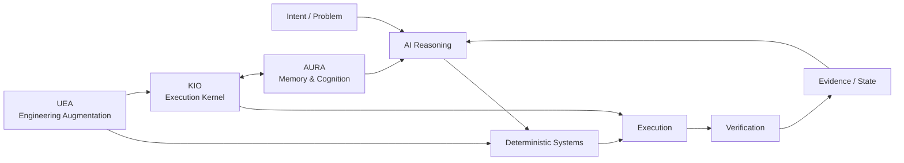

---

# 👋 Joel — systems-focused CSE student

> **GitHub Developer Program Member** — building and experimenting with software that integrates with the GitHub ecosystem. GitHub automatically displays the official Developer Program Member badge on eligible profiles. [Program details](https://docs.github.com/en/integrations/concepts/github-developer-program)

I build **AI systems, developer tools, automation, and experimental software systems** with an emphasis on execution, architecture, verification, and measurable behavior.

> **What should an AI reason about, and what should reliable software do deterministically?**

I learn by shipping, breaking things, measuring them, and then hardening the parts that are worth keeping.

> **2026 contribution milestone:** 500+ GitHub contributions, alongside ongoing upstream and fork-side engineering work.

  

---

## 🏗️ Engineering Portfolio

### Architecture at a glance

This is the design boundary running through the portfolio: **reasoning handles ambiguity; deterministic infrastructure owns execution, state, safety, and verification.**

### ⚙️ [gh-ops](https://github.com/aspire488/gh-ops) — Operational Intelligence Platform

A reusable, deterministic GitHub operations layer running on GitHub Actions. gh-ops combines repository, CI, release, and security monitoring with OSS opportunity intelligence, developer activity reporting, persistent state, scheduled workflows, and outbound Telegram notifications.

The system is deliberately **read-only against GitHub**: collection and analysis are automated, while execution boundaries, state, and verification remain deterministic.

`Python` `GitHub Actions` `GitHub API` `Telegram` `State & Events` `OSS Intelligence`

**Current:** Phases 1–8 are implemented, with scheduled GitHub Actions, dedicated CI validation, and Telegram operations live. CI validates Ruff, mypy, and the full pytest suite on pushes and pull requests. The latest CI hardening fixed an editable-install failure caused by an unsupported setuptools backend in [`gh-ops #2`](https://github.com/aspire488/gh-ops/pull/2). The current development line adds **cross-run OSS opportunity deduplication and run summaries**, with the latest local validation at **1,084 passed, 1 skipped**. The system now tracks opportunity identity across runs and produces deterministic run-level summaries for the notification/reporting path.

### 🛠️ [Universal Engineering Augmentation](https://github.com/aspire488/Universal-Engineering-Augmentation) — Public Alpha

Agent-neutral engineering infrastructure for coding agents. UEA moves repeatable engineering work from probabilistic reasoning into deterministic code intelligence, dependency/impact analysis, verification, property/mutation testing, formal reasoning, candidate isolation, routing, provenance, event logging, analytics, and reusable capabilities.

The core stays agent-neutral while integrations can sit beside **OpenCode, Claude Code, Codex, or other coding agents**.

`Python` `Tree-sitter` `Z3` `Hypothesis` `SQLite` `DuckDB` `MCP`

### 🧠 [AURA](https://github.com/aspire488/AURA) — Architecture checkpoint

**Autonomous Unified Reasoning Architecture** — a FastAPI-based memory and cognition backend implementing persistent memory storage/retrieval, cognitive artifacts, and reflection-oriented processing for long-lived agent state.

`Python` `FastAPI` `Memory` `Cognitive Artifacts` `Agents`

### 🤖 [KIO](https://github.com/aspire488/Kio) — Gate 5 complete · Maintenance

**Kernel for Intelligent Orchestration** — a modular execution kernel that resolves capabilities, plans actions, applies security gates, dispatches providers, executes tools, and verifies resulting state.

KIO turns intent into real actions through:

> **Observe → Reason → Plan → Execute → Verify → Adapt**

It owns capability resolution, provider dispatch, security gates, browser/MCP execution, artifacts, runtime state, recovery, and verification of real side effects.

The repository currently contains **63 validated automation templates** integrated through the canonical KIO execution path.

`Python` `Automation` `Browser Automation` `MCP` `Provider Systems` `Verification`

> **Architecture principle:** AI handles ambiguity and strategy; deterministic software owns execution, safety, state, and verification.

---

## 🧪 Frozen Product Prototypes

These projects are no longer active product-development tracks. They have been hardened into inspectable, reproducible portfolio artifacts.

### ⚡ [CodeFlow](https://github.com/aspire488/codeflow) — Frozen Prototype

Execution-first programming-learning prototype focused on visible execution state, code visualization, exercises, and bounded AI assistance.

**Live:** [codeflow-app-sigma.vercel.app](https://codeflow-app-sigma.vercel.app)

`JavaScript` `Vite` `Execution Visualization` `PWA`

**Final hardening:** Node 22, Vite 8, production-build CI, tagged release validation, Dependabot, CodeQL, deployment security headers, explicit prototype boundary, and MIT licensing.

### 💊 [MediMind Care](https://github.com/aspire488/medimind) — Frozen Prototype

AI-assisted medication-reminder and health-workflow prototype exploring role-specific UX, deterministic reminders, accessibility, synthetic data, and bounded AI assistance.

**Live:** [medimind-seven.vercel.app](https://medimind-seven.vercel.app/)

`React 18` `Vite 6` `Gemini` `Accessibility` `Safety Boundaries`

**Final hardening:** Node 22 CI baseline, Playwright browser smoke coverage, Chromium validation, CodeQL, Dependabot, deployment security headers, environment/credential hygiene, explicit medical safety boundary, and MIT licensing.

The application intentionally remains on its React 18/Vite 6 prototype stack rather than taking an unvalidated framework migration.

---

## 🔗 Project Map

| Project | Stage | Repository | Live / Docs |
|---|---|---|---|
| ⚙️ gh-ops | Operational / Phase 8 | [GitHub](https://github.com/aspire488/gh-ops) | [README](https://github.com/aspire488/gh-ops#readme) |
| 🤖 KIO | Gate 5 complete · Maintenance | [GitHub](https://github.com/aspire488/Kio) | [README](https://github.com/aspire488/Kio#readme) |
| 🧠 AURA | Architecture checkpoint | [GitHub](https://github.com/aspire488/AURA) | [Architecture](https://github.com/aspire488/AURA#readme) |
| 🛠️ UEA | Public Alpha | [GitHub](https://github.com/aspire488/Universal-Engineering-Augmentation) | [README](https://github.com/aspire488/Universal-Engineering-Augmentation#readme) |
| ⚡ CodeFlow | Frozen Prototype | [GitHub](https://github.com/aspire488/codeflow) | [Live](https://codeflow-app-sigma.vercel.app) |
| 💊 MediMind | Frozen Prototype | [GitHub](https://github.com/aspire488/medimind) | [Live](https://medimind-seven.vercel.app/) |

---

## 🗺️ OSS Atlas

> The complete open-source engineering archive now lives in **[OSS Atlas](https://github.com/aspire488/oss-atlas)** — contribution records, upstream work, research, case studies, experiments, learnings, and the spatial/3D engineering track.

## 🔀 Open-Source Engineering

I use open source as an external engineering track: working across unfamiliar codebases, contributing real changes, and learning how software is built and maintained outside my own projects.

### Upstream work

I distinguish **merged work from open proposals** so the repository status is explicit.

#### ✅ Merged upstream work
- [PyRIT #2762 — Dataset Summary API](https://github.com/microsoft/PyRIT/pull/2762)  
  **Merged upstream on September 24, 2026** after maintainer review and multiple refinement rounds. Added memory-backed dataset summaries with aggregation, selection-key isolation, unnamed/whitespace dataset handling, metadata query controls, `loaded_only` behavior, and regression coverage. Final merge commit: `47c6151a`.

- [aios #2457 — Preserve `length` finish reason across streaming trailers](https://github.com/eumemic/aios/pull/2457)  
  Merged upstream fix preserving provider-reported `finish_reason="length"` when trailing streaming chunks clobber the assembled finish reason, with regression coverage and `content_filter` precedence handling.

- [aios #2460 — Preserve LiteLLM parameter translation](https://github.com/eumemic/aios/pull/2460)  
  Merged upstream fix that preserves LiteLLM provider-specific parameter translation while retaining explicit `allowed_openai_params` overrides, with regression coverage for mapped, unmapped, and explicitly forced parameters.

- [aios #2459 — Preserve timeout bound in child outcome](https://github.com/eumemic/aios/pull/2459)  
  **Merged upstream** after maintainer review. Preserves whether workflow-child timeout resolution came from the `deadline` or `spend` bound while keeping `kind="timeout"` unchanged for compatibility, with regression coverage for both trigger paths.

- [GitHub Profile Analyzer #30 — Evidence-weighted impact scoring](https://github.com/0xarchit/github-profile-analyzer/pull/30)  
  **Merged upstream** after maintainer approval. Refined impact scoring with repository-quality evidence and improved viewport-aware factor tooltips, with regression coverage.

## 🛡️ PyRIT — AI Red-Teaming Contributions

I’m actively contributing to **[Microsoft PyRIT](https://github.com/microsoft/PyRIT)**, an open-source framework for AI red teaming. My recent upstream work includes a merged dataset-summary contribution, alongside a follow-up fix prepared on my fork.

### 🔥 Current PyRIT work

- **[#2762 — Dataset Summary API](https://github.com/microsoft/PyRIT/pull/2762)** — **merged upstream on September 24, 2026** after maintainer review. Added memory-backed dataset summaries and iterated through feedback covering aggregation, SQLite collation behavior, unnamed/whitespace dataset identity, selection-key isolation, metadata query size, and `loaded_only` behavior. Roman Lutz verified the substantive concerns against real stored seeds, and the final test-cleanup commit was merged with the implementation. Merge commit: `47c6151a`.
- **[#2782 — Canonical technique names in scenario run summaries](https://github.com/aspire488/PyRIT/tree/fix/promptinject-technique-summary)** — follow-up fix prepared on my fork. Corrects `techniques_used` to use the persisted canonical `technique_name` rather than a potentially goal/objective-bearing `display_group`, with regression coverage. The fork PR is open while an upstream submission path is being finalized.

> **Why it matters:** this work involves navigating a large unfamiliar codebase, understanding existing data models and service boundaries, responding to maintainer review, and adding targeted regression coverage rather than making isolated demo changes.

**Status is intentionally explicit:** #2762 is merged upstream; #2782 is currently fork-side work until an upstream PR exists.

---

### 🧪 Microsoft RAMPART — Agentic AI Security Testing

**[Microsoft RAMPART](https://github.com/microsoft/RAMPART)** is a pytest-native safety and security testing framework for agentic AI applications, built around repeatable adversarial testing and evaluation-driven assertions. It extends the same AI-security direction as the PyRIT work above into agent-focused regression testing and CI.

> **Next AI-security target:** RAMPART is tracked here as a target project, not as a claimed contribution or merged PR.

`Python` `Pytest` `AI Security` `Red Teaming` `Agentic AI`
### 🌀 TopoCore — Spatial Execution Contribution

- **[TopoCore — cycle detection for spatial execution](https://github.com/KARAN-D05/TopoCore/pull/1)** — added deterministic cycle detection to the experimental 2D spatial execution visualizer by tracking `(X, Y, Direction)` states, stopping repeated execution loops, and resetting execution-trace state on reset/clear. This explores an unconventional execution model where program flow is defined by movement through symbolic space.

### 🆕 AI-security OSS contributions — September 23–24, 2026

- **Microsoft PyRIT #2762** — **merged upstream** after maintainer review; dataset summary API with memory-backed aggregation and regression coverage.
- **NVIDIA garak #1** — fork-side fix for `IterativeProbe` when `soft_probe_prompt_cap=None`, preserving uncapped behavior and adding regression coverage.
- **UK AI Security Institute Inspect AI #1** — fork-side fix for Google inline-image conversion for raw binary `Blob.data` by base64-encoding bytes before building the data URI.

> Status is tracked explicitly: merged upstream work is separated from open fork-side proposals.

### 🔥 Latest engineering work — September 24, 2026
- **TypeSafe SDK JS #8** — prepared a fork-side fix for Node timer overflow: rejects timeout values above `2_147_483_647` ms at validation time, covers both client-level and per-call timeouts, and adds boundary regression tests. The TypeSafe repository currently restricts external PR creation, so this remains **fork-side work, not an upstream PR**.

- **SiYuan #19815** — prepared `aspire488/siyuan#1` for expired Streamable HTTP MCP sessions: `mcp.ErrSessionMissing` now gets synchronous session recovery with exactly one safe replay, while ambiguous transport failures remain non-retriable; added regression coverage for both paths.

- **RisingWave #27181** — extended the correlated-reference regression through the real `LogicalApply → ApplyEliminateRule → to_batch()` boundary, including a multi-row `LogicalValues` case with the correlated reference in a non-first row.
- **KiroCrew #12861** — hardened bounded PDF extraction across Windows process limits and Python import isolation, while adding child-extractor protocol coverage.
- **aios #2458** — cleaned the remaining CI newline failures after the streaming truncation/finish-reason work.
- **aios #2459** — **merged upstream**. Preserves the timeout bound (`deadline` vs `spend`) in child outcomes while keeping `kind="timeout"` compatible, with regression coverage for both paths.
- **Microsoft PyRIT #2762** — **merged upstream** after multiple review rounds and follow-up commits. Added the memory-backed dataset summary API, typed selection keys, loaded/provider availability, logical-example/objective counts, aggregated metadata, unnamed-dataset handling, and regression coverage.
- **OpenHands #17579** — condenser metadata/key/minimum fixes remain on the PR while upstream review infrastructure completes its checks.
- **OpenTelemetry Erlang #822** — maintainer-requested rebase remains the next upstream action; no merge-style workaround was introduced.

> **September 24 OSS pass:** current work is concentrated on reviewer-requested engineering fixes, regression coverage, and closing the review loops already in flight.

### 🔥 Latest engineering work — September 23, 2026

- **PyRIT #2782** — fixed scenario run summaries so `techniques_used` uses the persisted canonical `technique_name` instead of a potentially goal/objective-bearing `display_group`, with regression coverage. The fix is currently tracked as an open fork PR.
- **PyRIT #2762** — maintainer-driven dataset-summary refinement reached substantive verification: unnamed/whitespace identity, SQLite collation semantics, named `__unnamed__` isolation, logical-example counting, metadata query size, and `loaded_only` behavior were verified by Roman Lutz against real stored data on `bcc38ad4`. A follow-up test-cleanup commit was then pushed to the branch; the historical review entry is now closed by the upstream merge.
- **gh-ops #2** — fixed the GitHub Actions editable-install failure by moving to the supported `setuptools.build_meta` backend.
- **gh-ops** — completed the cross-run OSS opportunity deduplication and run-summary batch; latest local validation is **1,084 passed, 1 skipped**.
- **aios #2459** — **merged upstream**; preserved the timeout bound (`deadline` vs `spend`) in child outcomes and the caller-visible `AgentError` contract, with regression coverage.
- **aios #2458** — carried streaming `finish_reason="length"` into truncation telemetry, including loop-level SSE subscriber coverage.
- **GitHub Profile Analyzer #30** — refined evidence-weighted impact scoring, added repository-quality evidence handling, and fixed the factor tooltip so long evidence breakdowns stay within the viewport. The PR was approved by the maintainer and merged upstream.
- **OpenAI Codex #46658** — contributed to an architecture discussion around adaptive allocation, independent verification, reassessment, and feedback loops around agents.

- [NVIDIA garak #1 — Handle unset soft prompt cap in IterativeProbe](https://github.com/aspire488/garak/pull/1) — fixes the uncapped `soft_probe_prompt_cap=None` path so iterative probes retain an infinite termination bound, with regression coverage for `follow_prompt_cap=True`.
- [UK AI Security Institute Inspect AI #1 — Base64 encode Google inline image bytes](https://github.com/aspire488/inspect_ai/pull/1) — fixes Google GenAI `Blob.data` conversion by base64-encoding raw inline image bytes before constructing the data URI, with binary-image regression coverage.
- [Microsoft PyRIT #2762 — Add dataset summary API](https://github.com/microsoft/PyRIT/pull/2762) — adds memory-backed dataset summaries; substantive maintainer review concerns have been verified, with the PR still open pending final disposition.

#### 🔄 Open upstream PRs — September 2026

- [TopoCore — Spatial execution cycle detection](https://github.com/KARAN-D05/TopoCore/pull/1) — adds deterministic repeated-state detection to the 2D spatial execution simulator.

**24 open upstream/fork PRs currently tracked**, spanning AI infrastructure, developer tooling, databases/query optimizers, observability, security tooling, and systems software. This list is intentionally curated around substantive engineering work rather than contribution-count inflation.

- [KiroCrew #12861 — Restore PDF search behind bounded extraction](https://github.com/kirodotdev/KiroCrew/pull/12861) — bounded PDF extraction with isolated child processing, Windows-safe execution, truncation handling, and regression coverage.
- [LlamaIndex #23201 — Preserve retrieved scores during prev/next expansion](https://github.com/run-llama/llama_index/pull/23201) — preserves original retrieval scores through overlapping previous/next-node expansion.
- [GitHub Profile Analyzer #30 — Evidence-weighted impact scoring](https://github.com/0xarchit/github-profile-analyzer/pull/30) — balances adoption signals with independent repository evidence and regression coverage.
- [OpenHands #17579 — Align condenser max-size validation](https://github.com/OpenHands/OpenHands/pull/17579) — aligns the UI metadata and persistence mocks with the agent-server `condenser.max_size` contract and minimum of 20.
- [N3MO #39 — Ruby/Kotlin language routing coverage](https://github.com/RajX-dev/N3MO/pull/39) — regression coverage for parser loading, extension routing, and symbol extraction.
- [IntelliJ PowerShell #506 — Resolve pwsh reparse points](https://github.com/intellij-powershell/intellij-powershell/pull/506) — handles WindowsApps PowerShell executable reparse points.
- [quiche #2756 — Unify PTO timer duration](https://github.com/cloudflare/quiche/pull/2756) — centralizes PTO-based timer duration.
- [quiche #2758 — Verify peers with custom CA](https://github.com/cloudflare/quiche/pull/2758) — keeps peer verification enabled when a custom CA is supplied.
- [quiche #2759 — Ignore ACKs for non-in-flight packets](https://github.com/cloudflare/quiche/pull/2759) — prevents Reno congestion-window growth from ACKs for non-in-flight packets.
- [OpenTelemetry Erlang #822 — Isolate Req spans across retries](https://github.com/open-telemetry/opentelemetry-erlang-contrib/pull/822) — isolates client span state across retries and redirects.
- [RisingWave #27181 — Inspect correlated refs in LogicalValues](https://github.com/risingwavelabs/risingwave/pull/27181) — detects correlated references inside `LogicalValues` rows to protect decorrelation.
- [MVT #939 — Preserve equals signs in STIX indicators](https://github.com/mvt-project/mvt/pull/939) — fixes parsing of indicator values containing `=`.
- [Coder #29668 — Deduplicate Unknown AI Gateway clients](https://github.com/coder/coder/pull/29668) — normalizes nullable/literal Unknown client identities.
- [AI Platform AWS #4 — Fix provider routing specificity](https://github.com/tysoncung/ai-platform-aws/pull/4) — fixes routing precedence between direct Anthropic and generic Bedrock Claude paths.
- [AgentBench #8 — Add global command palette](https://github.com/PicadoLabs/agent-bench/pull/8) — adds global command navigation, fuzzy search, keyboard interaction, and accessibility semantics.
- [GoalAI #1 — Prediction Intelligence Lab](https://github.com/adityamallia7/GoalAI-Score-predictor-26/pull/1) — reproducible seeded Monte Carlo analysis, sensitivity/stability metrics, tests, and documentation.
- [aios #2458 — Record streaming length as truncated output](https://github.com/eumemic/aios/pull/2458) — preserves provider timeout/truncation telemetry at the loop layer.
- [aios #2459 — Preserve timeout bound in child outcome](https://github.com/eumemic/aios/pull/2459) — retains whether child execution hit the deadline or spend ceiling and now exposes that bound through the caller-visible `AgentError` contract with regression coverage.
- [Cognee #2 — Telemetry error-type fix](https://github.com/aspire488/cognee/pull/2) — fork-side validation branch for telemetry error classification; not an upstream contribution.
- [Cognee #1 — Active agent status](https://github.com/aspire488/cognee/pull/1) — fork-side active-agent status work; maintained separately from upstream contributions.
- [UEA #15 — Publish agent adapter and CLI integration](https://github.com/aspire488/Universal-Engineering-Augmentation/pull/15) — documents the agent adapter and CLI integration path.
- [Profile README #3 — Refresh engineering activity](https://github.com/aspire488/aspire488/pull/3) — profile-repository documentation work; current README updates are also applied directly to main.
- [linguist #1 — Trim .example suffix before detection](https://github.com/aspire488/linguist/pull/1) — fork-side language-detection fix under review.

> **Status note:** Open means the PR is currently open on GitHub; it does not imply maintainer acceptance or CI success. Fork-side PRs are explicitly identified so they are not confused with upstream contributions.

#### 🆕 PyRIT follow-up — September 23, 2026

- [PyRIT #2782 — Canonical technique names in scenario run summaries](https://github.com/aspire488/PyRIT/pull/1) — fork-side fix for scenario run summaries that incorrectly exposed `display_group` as `techniques_used`. The patch uses persisted `technique_name` when available and adds a regression where the display group and canonical technique intentionally differ.
- [PyRIT #2762 — Dataset summary API](https://github.com/microsoft/PyRIT/pull/2762) — **merged upstream** after substantive maintainer verification and final test cleanup.

> **PyRIT note:** #2782 is explicitly shown as fork-side work until an upstream pull request exists; it is not counted as merged or upstream contribution.

#### 🧪 In progress

- [Cognee #4957 — Detect active agent connections](https://github.com/aspire488/cognee/tree/fix/4957-active-agent-status)  
  Implements active-connection detection in the dashboard/integrations hook with focused regression coverage. The fix remains on the fork branch pending upstream PR creation.

- [Cognee telemetry follow-up — validation branch](https://github.com/aspire488/cognee/tree/fix/telemetry-error-type)  
  Explored a narrow pipeline error-type telemetry fix, then verified it overlaps with existing upstream telemetry work (#5159). It is therefore **not listed as an upstream contribution**.

##### Recent OSS validation — September 2026

The aios contribution sequence now includes three merged upstream fixes (#2457, #2459, and #2460), with #2460 following the earlier streaming/truncation work as a separate provider-parameter correctness fix. #2459 preserves caller-visible timeout-bound provenance (`deadline` vs `spend`) while retaining legacy timeout compatibility. #2458 remains open and separately scoped.

The latest local validation pass covered three repositories with focused fixes/regression coverage and remote PR updates. Separately, `gh-ops` CI was investigated from the failing workflow logs and the packaging failure was isolated and fixed in [`gh-ops #2`](https://github.com/aspire488/gh-ops/pull/2):

- [gh-ops #2](https://github.com/aspire488/gh-ops/pull/2) — fixes the CI editable-install failure by switching from the unsupported `setuptools.backends._legacy:_Backend` to `setuptools.build_meta`.
- [PyRIT #2762](https://github.com/microsoft/PyRIT/pull/2762) — merged upstream after maintainer review of dataset-summary aggregation, metadata handling, selection-key isolation, unnamed-dataset behavior, and `loaded_only` semantics.
- [N3MO #39](https://github.com/RajX-dev/N3MO/pull/39) — fixed Kotlin call-target extraction exposed by the real AST regression test; targeted Ruby/Kotlin tests passed.
- [OpenHands #17579](https://github.com/OpenHands/OpenHands/pull/17579) — aligned condenser max-size metadata with the agent-server minimum, updated persistence mocks/tests, and recorded focused local validation.

> Local validation is reported separately from upstream CI; platform-specific or maintainer-side checks remain the responsibility of the upstream project.

#### Earlier upstream work

- [Clicky #72 — Contributor quickstart revamp](https://github.com/daniel5151/clicky/pull/72)  
  Emulator contributor workflow covering boot paths, safe disk-image setup, firmware smoke tests, troubleshooting, and development handoff.

#### 🔎 Upstream code review

- [Agent Substrate #1104 — dual-stack egress regression review](https://github.com/agent-substrate/substrate/pull/1104)  
  Reviewed the in-cluster egress test against [#1089](https://github.com/agent-substrate/substrate/issues/1089), identifying that the dual-stack case currently verifies only eventual HTTP success and does not directly prove the broken-IPv6 → IPv4 fallback behavior. Suggested making the regression test exercise the actual no-route/fallback condition rather than merely adding family coverage.

#### 🔎 Upstream architecture discussions

- [Agent Sandbox #1615 — Routing requests across multiple claimed Sandboxes](https://github.com/kubernetes-sigs/agent-sandbox/issues/1615)  
  Discussed the boundary between higher-level orchestration and the sandbox router for multi-Sandbox request distribution, including instance selection, readiness/capacity signals, retry/failover semantics, and a clean orchestrator → router → Sandbox responsibility split.

#### 💬 Community technical discussions

- [Lexical #8771 — Named Slots for paginated editors](https://github.com/facebook/lexical/discussions/8771)  
  Discussed separating page-region modeling from pagination/flow logic.

- [MCP Registry #921 — Using the published Docker image](https://github.com/modelcontextprotocol/registry/discussions/921)  
  Explained the GHCR image workflow and PostgreSQL-backed deployment model.

- [VS Code Discussions #3109 — Diagnosing Electron main-process hangs](https://github.com/microsoft/vscode-discussions/discussions/3109)  
  Proposed an incident-diagnostics workflow around watchdogs, event-loop health, Node diagnostic reports, process dumps, profiling, and IPC telemetry.

- [MVT Discussions — STIX indicator parsing](https://github.com/mvt-project/mvt/discussions)  
  Discussed whether MVT should keep lightweight STIX parsing or introduce a small explicit parsing/validation boundary for malformed and edge-case indicator values.

- [OpenAI Codex #46658 — Beyond Auto mode: adaptive allocation](https://github.com/openai/codex/discussions/46658)  
  Discussed evidence-driven allocation of models, reasoning effort, tools, and subagents, including reassessment triggers, effective inherited configuration, rerouting observability, hard verification boundaries, and feedback loops driven by independently checked task-state changes.

> **Selected, not exhaustive.** This section intentionally distinguishes **proposed upstream work** from **accepted/merged work**. Discussion participation is listed separately from code contributions.

 This section favors substantive engineering work over activity-count inflation.

**Open-source contribution history:** [View my PRs across GitHub](https://github.com/pulls?q=is%3Apr%20author%3Aaspire488)

---

## 💬 Technical Discussions

I also contribute through **GitHub Discussions** — answering concrete engineering questions in unfamiliar codebases and sharing implementation-level reasoning with maintainers and other developers.

### Recent discussions

- 🧩 [Lexical #8771 — Named Slots for paginated editors](https://github.com/facebook/lexical/discussions/8771)  
  Discussed separating **page-region modeling** from **pagination/flow logic**, using Named Slots for independently editable header/footer regions while keeping content pagination as a higher-level layout concern.

- 🐳 [MCP Registry #921 — Using the published Docker image](https://github.com/modelcontextprotocol/registry/discussions/921)  
  Explained the GHCR image workflow, the distinction between the pre-built Registry image and the full local development environment, and the PostgreSQL dependency for persistent deployments.

- ⚡ [VS Code Discussions #3109 — Diagnosing Electron main-process hangs](https://github.com/microsoft/vscode-discussions/discussions/3109)  
  Proposed a practical incident-diagnostics workflow around external watchdogs, event-loop health, Node diagnostic reports, process dumps, CPU profiling, IPC telemetry, and separating JavaScript starvation from synchronous/native/OS blocking.

- 🧩 [MVT Discussions — STIX indicator parsing](https://github.com/mvt-project/mvt/discussions)  
  Discussed the parsing boundary around STIX indicators, including values containing `=`, malformed patterns, validation, and preserving existing detection semantics.

> Discussion answers are kept focused on reproducible engineering practices, implementation details, and primary documentation rather than activity for its own sake.

---

## 🧠 Engineering Principles

- **Deterministic software owns execution; AI handles ambiguity.**
- **Verification is part of implementation, not a final step.**
- **Measure behavior before claiming improvement.**

---

## 🛠️ Stack

<strong>Languages</strong> 

  
<strong>Frameworks & Platforms</strong> 

  
<strong>Tools & Infrastructure</strong> 

---

## 🏷️ Technologies & Tools

<strong>Languages</strong> 

<strong>Systems & Frameworks</strong> 

<strong>Engineering & Infrastructure</strong> 

<strong>AI / Developer Workflow</strong> 

> These badges describe the technologies currently represented in my public projects and engineering workflow — they are not certification badges.

---

## 📊 GitHub Activity

<picture>
  <source media="(prefers-color-scheme: dark)" srcset="./assets/profile/overview.dark.svg" />
  <source media="(prefers-color-scheme: light)" srcset="./assets/profile/overview.light.svg" />
  
</picture>

<picture>
  <source media="(prefers-color-scheme: dark)" srcset="./assets/profile/contributions.dark.svg" />
  <source media="(prefers-color-scheme: light)" srcset="./assets/profile/contributions.light.svg" />
  
</picture>

<picture>
  <source media="(prefers-color-scheme: dark)" srcset="./assets/profile/activity.dark.svg" />
  <source media="(prefers-color-scheme: light)" srcset="./assets/profile/activity.light.svg" />
  
</picture>

<picture>
  <source media="(prefers-color-scheme: dark)" srcset="./assets/profile/languages.dark.svg" />
  <source media="(prefers-color-scheme: light)" srcset="./assets/profile/languages.light.svg" />
  
</picture>

<picture>
  <source media="(prefers-color-scheme: dark)" srcset="./assets/profile/rhythm.dark.svg" />
  <source media="(prefers-color-scheme: light)" srcset="./assets/profile/rhythm.light.svg" />
  
</picture>

<picture>
  <source media="(prefers-color-scheme: dark)" srcset="./assets/profile/composition.dark.svg" />
  <source media="(prefers-color-scheme: light)" srcset="./assets/profile/composition.light.svg" />
  
</picture>

> Activity cards are generated by GitHub Actions and committed to this profile repository, avoiding fragile third-party statistics endpoints.

> **Project status note — September 23, 2026:** KIO has completed Gate 5 and is currently in a maintenance/security-documentation state; recent commits are cleanup and hardening rather than a restart of feature development. AURA remains at its June 2026 architecture checkpoint with no active feature-development line.

---

## 🎯 Current Direction

| Track | State / next milestone |
|---|---|
| ⚙️ gh-ops | Phase 8 operational hardening + OSS persistence |
| 🤖 KIO | **Gate 5 complete · maintenance** — latest activity is security/documentation cleanup and hardening |
| 🧠 AURA | **Architecture checkpoint** — core cognition architecture is complete; no active feature-development line |
| 🛠️ UEA | Public alpha + reusable engineering infrastructure |
| ⚡ CodeFlow | Frozen, hardened prototype |
| 💊 MediMind | Frozen, hardened prototype |
| 🌍 Open Source | Cross-project contributions + upstream engineering |

---

<strong>Building in public • Shipping real systems • Learning by doing</strong>

