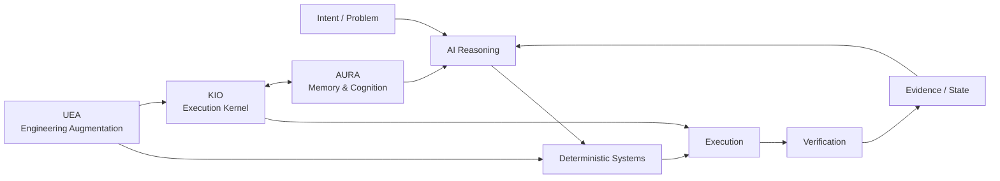

---

# 👋 Joel — systems-focused CSE student

> **GitHub Developer Program Member** — building and experimenting with software that integrates with the GitHub ecosystem. GitHub automatically displays the official Developer Program Member badge on eligible profiles. [Program details](https://docs.github.com/en/integrations/concepts/github-developer-program)

I build **AI systems, developer tools, automation, and experimental software systems** with an emphasis on execution, architecture, verification, and measurable behavior.

> **What should an AI reason about, and what should reliable software do deterministically?**

I learn by shipping, breaking things, measuring them, and then hardening the parts that are worth keeping.

---

## 🏗️ Engineering Portfolio

### Architecture at a glance

This is the design boundary running through the portfolio: **reasoning handles ambiguity; deterministic infrastructure owns execution, state, safety, and verification.**

### ⚙️ [gh-ops](https://github.com/aspire488/gh-ops) — Operational Intelligence Platform

A reusable, deterministic GitHub operations layer running on GitHub Actions. gh-ops combines repository, CI, release, and security monitoring with OSS opportunity intelligence, developer activity reporting, persistent state, scheduled workflows, and outbound Telegram notifications.

The system is deliberately **read-only against GitHub**: collection and analysis are automated, while execution boundaries, state, and verification remain deterministic.

`Python` `GitHub Actions` `GitHub API` `Telegram` `State & Events` `OSS Intelligence`

**Current:** Phases 1–8 are implemented, with GitHub Actions and Telegram operations live. The next work is persistent cross-run OSS opportunity state and its notification path.

### 🛠️ [Universal Engineering Augmentation](https://github.com/aspire488/Universal-Engineering-Augmentation) — Public Alpha

Agent-neutral engineering infrastructure for coding agents. UEA moves repeatable engineering work from probabilistic reasoning into deterministic code intelligence, dependency/impact analysis, verification, property/mutation testing, formal reasoning, candidate isolation, routing, provenance, event logging, analytics, and reusable capabilities.

The core stays agent-neutral while integrations can sit beside **OpenCode, Claude Code, Codex, or other coding agents**.

`Python` `Tree-sitter` `Z3` `Hypothesis` `SQLite` `DuckDB` `MCP`

### 🧠 [AURA](https://github.com/aspire488/AURA) — Paused

**Autonomous Unified Reasoning Architecture** — a FastAPI-based memory and cognition backend implementing persistent memory storage/retrieval, cognitive artifacts, and reflection-oriented processing for long-lived agent state.

`Python` `FastAPI` `Memory` `Cognitive Artifacts` `Agents`

### 🤖 [KIO](https://github.com/aspire488/Kio) — Paused after Gate 5

**Kernel for Intelligent Orchestration** — a modular execution kernel that resolves capabilities, plans actions, applies security gates, dispatches providers, executes tools, and verifies resulting state.

KIO turns intent into real actions through:

**Observe → Reason → Plan → Execute → Verify → Adapt**

It owns capability resolution, provider dispatch, security gates, browser/MCP execution, artifacts, runtime state, recovery, and verification of real side effects.

The repository currently contains **63 validated automation templates** integrated through the canonical KIO execution path.

`Python` `Automation` `Browser Automation` `MCP` `Provider Systems` `Verification`

> **Architecture principle:** AI handles ambiguity and strategy; deterministic software owns execution, safety, state, and verification.

---

## 🧪 Frozen Product Prototypes

These projects are no longer active product-development tracks. They have been hardened into inspectable, reproducible portfolio artifacts.

### ⚡ [CodeFlow](https://github.com/aspire488/codeflow) — Frozen Prototype

Execution-first programming-learning prototype focused on visible execution state, code visualization, exercises, and bounded AI assistance.

**Live:** [codeflow-app-sigma.vercel.app](https://codeflow-app-sigma.vercel.app)

`JavaScript` `Vite` `Execution Visualization` `PWA`

**Final hardening:** Node 22, Vite 8, production-build CI, tagged release validation, Dependabot, CodeQL, deployment security headers, explicit prototype boundary, and MIT licensing.

### 💊 [MediMind Care](https://github.com/aspire488/medimind) — Frozen Prototype

AI-assisted medication-reminder and health-workflow prototype exploring role-specific UX, deterministic reminders, accessibility, synthetic data, and bounded AI assistance.

**Live:** [medimind-seven.vercel.app](https://medimind-seven.vercel.app/)

`React 18` `Vite 6` `Gemini` `Accessibility` `Safety Boundaries`

**Final hardening:** Node 22 CI baseline, Playwright browser smoke coverage, Chromium validation, CodeQL, Dependabot, deployment security headers, environment/credential hygiene, explicit medical safety boundary, and MIT licensing.

The application intentionally remains on its React 18/Vite 6 prototype stack rather than taking an unvalidated framework migration.

---

## 🔗 Project Map

| Project | Stage | Repository | Live / Docs |
|---|---|---|---|
| ⚙️ gh-ops | Operational / Phase 8 | [GitHub](https://github.com/aspire488/gh-ops) | [README](https://github.com/aspire488/gh-ops#readme) |
| 🤖 KIO | Paused after Gate 5 | [GitHub](https://github.com/aspire488/Kio) | [README](https://github.com/aspire488/Kio#readme) |
| 🧠 AURA | Paused | [GitHub](https://github.com/aspire488/AURA) | [Architecture](https://github.com/aspire488/AURA#readme) |
| 🛠️ UEA | Public Alpha | [GitHub](https://github.com/aspire488/Universal-Engineering-Augmentation) | [README](https://github.com/aspire488/Universal-Engineering-Augmentation#readme) |
| ⚡ CodeFlow | Frozen Prototype | [GitHub](https://github.com/aspire488/codeflow) | [Live](https://codeflow-app-sigma.vercel.app) |
| 💊 MediMind | Frozen Prototype | [GitHub](https://github.com/aspire488/medimind) | [Live](https://medimind-seven.vercel.app/) |

---

## 🔀 Open-Source Engineering

I use open source as an external engineering track: working across unfamiliar codebases, contributing real changes, and learning how software is built and maintained outside my own projects.

### Upstream work

I distinguish **merged work from open proposals** so the repository status is explicit.

#### 🔄 Open upstream PRs

**Current batch**

- [Hiero Bot #100 — Coalesce concurrent config cache misses](https://github.com/AnthropicBots/hiero-bot-py/pull/100)  
  Adds per-repository in-flight request coalescing so concurrent webhook bursts issue one GitHub contents request, with regression coverage.

- [Thrylos #4 — Enforce Tier-A determinism in CI](https://github.com/thrylos-labs/thrylos/issues/4)  
  Adds an auditable CI source check preventing floating-point types from entering Tier-A consensus-critical Rust crates.

- [Coder #29668 — Deduplicate `Unknown` AI Gateway clients](https://github.com/coder/coder/pull/29668)  
  Groups nullable and literal `Unknown` client values by their displayed identity and adds regression coverage.

- [quiche #2756 — Unify PTO-based timer duration](https://github.com/cloudflare/quiche/pull/2756)  
  Centralizes the 3×PTO duration used by timeout paths to keep timer calculations consistent.

- [MVT #939 — Preserve equals signs in STIX indicator values](https://github.com/mvt-project/mvt/pull/939)  
  Fixes STIX parsing for values containing `=` and adds regression coverage for URL query parameters.

- [ai-memory #828 — Expand agent-memory comparison coverage](https://github.com/akitaonrails/ai-memory/pull/828)  
  Expands the comparison matrix with Engram, Caura, TencentDB Agent Memory, memU, and EverOS.

- [RisingWave #27181 — Inspect correlated refs in LogicalValues](https://github.com/risingwavelabs/risingwave/pull/27181)  
  Fixes optimizer correlation detection for `LogicalValues` rows and adds regression coverage for correlated input references.

- [OpenTelemetry Erlang #822 — Isolate Req spans across retries and redirects](https://github.com/open-telemetry/opentelemetry-erlang-contrib/pull/822)  
  Fixes Req client-span state leaking into parent traces across retries/redirects and adds regression coverage for retry isolation.

**Earlier upstream work**

- [AI Platform AWS #4 — direct Anthropic provider routing](https://github.com/tysoncung/ai-platform-aws/pull/4)  
  Direct Anthropic Claude matches resolve before generic Bedrock routing independent of provider registration order, with regression coverage.

- [OpenHands #17579 — Condenser settings validation](https://github.com/OpenHands/OpenHands/pull/17579)  
  Adds validation and regression coverage for invalid negative values while preserving zero as valid.

- [AgentBench #8 — Global command palette](https://github.com/PicadoLabs/agent-bench/pull/8)  
  Global command navigation, fuzzy search, keyboard interaction, accessibility semantics, and architecture documentation.

- [GoalAI #1 — Prediction Intelligence Lab](https://github.com/adityamallia7/GoalAI-Score-predictor-26/pull/1)  
  Reproducible Monte Carlo analysis, sensitivity analysis, stability metrics, tests, and documentation.

- [N3MO #39 — Language routing and parser regression coverage](https://github.com/RajX-dev/N3MO/pull/39)

- [Clicky #72 — Contributor quickstart revamp](https://github.com/daniel5151/clicky/pull/72)  
  Emulator contributor workflow covering boot paths, safe disk-image setup, firmware smoke tests, troubleshooting, and development handoff.

#### 💬 Community technical discussions

- [Lexical #8771 — Named Slots for paginated editors](https://github.com/facebook/lexical/discussions/8771)  
  Discussed separating page-region modeling from pagination/flow logic.

- [MCP Registry #921 — Using the published Docker image](https://github.com/modelcontextprotocol/registry/discussions/921)  
  Explained the GHCR image workflow and PostgreSQL-backed deployment model.

- [VS Code Discussions #3109 — Diagnosing Electron main-process hangs](https://github.com/microsoft/vscode-discussions/discussions/3109)  
  Proposed an incident-diagnostics workflow around watchdogs, event-loop health, Node diagnostic reports, process dumps, profiling, and IPC telemetry.

- [MVT Discussions — STIX indicator parsing](https://github.com/mvt-project/mvt/discussions)  
  Discussed whether MVT should keep lightweight STIX parsing or introduce a small explicit parsing/validation boundary for malformed and edge-case indicator values.

> **Selected, not exhaustive.** This section intentionally distinguishes **proposed upstream work** from **accepted/merged work**. Discussion participation is listed separately from code contributions.

 This section favors substantive engineering work over activity-count inflation.

**Open-source contribution history:** [View my PRs across GitHub](https://github.com/pulls?q=is%3Apr%20author%3Aaspire488)

---

## 💬 Technical Discussions

I also contribute through **GitHub Discussions** — answering concrete engineering questions in unfamiliar codebases and sharing implementation-level reasoning with maintainers and other developers.

### Recent discussions

- 🧩 [Lexical #8771 — Named Slots for paginated editors](https://github.com/facebook/lexical/discussions/8771)  
  Discussed separating **page-region modeling** from **pagination/flow logic**, using Named Slots for independently editable header/footer regions while keeping content pagination as a higher-level layout concern.

- 🐳 [MCP Registry #921 — Using the published Docker image](https://github.com/modelcontextprotocol/registry/discussions/921)  
  Explained the GHCR image workflow, the distinction between the pre-built Registry image and the full local development environment, and the PostgreSQL dependency for persistent deployments.

- ⚡ [VS Code Discussions #3109 — Diagnosing Electron main-process hangs](https://github.com/microsoft/vscode-discussions/discussions/3109)  
  Proposed a practical incident-diagnostics workflow around external watchdogs, event-loop health, Node diagnostic reports, process dumps, CPU profiling, IPC telemetry, and separating JavaScript starvation from synchronous/native/OS blocking.

- 🧩 [MVT Discussions — STIX indicator parsing](https://github.com/mvt-project/mvt/discussions)  
  Discussed the parsing boundary around STIX indicators, including values containing `=`, malformed patterns, validation, and preserving existing detection semantics.

> Discussion answers are kept focused on reproducible engineering practices, implementation details, and primary documentation rather than activity for its own sake.

---

## 🧠 Engineering Principles

- **Deterministic software owns execution; AI handles ambiguity.**
- **Verification is part of implementation, not a final step.**
- **Measure behavior before claiming improvement.**

---

## 🛠️ Stack

<strong>Languages</strong> 

  
<strong>Frameworks & Platforms</strong> 

  
<strong>Tools & Infrastructure</strong> 

---

## 🏷️ Technologies & Tools

<strong>Languages</strong> 

<strong>Systems & Frameworks</strong> 

<strong>Engineering & Infrastructure</strong> 

<strong>AI / Developer Workflow</strong> 

> These badges describe the technologies currently represented in my public projects and engineering workflow — they are not certification badges.

---

## 📊 GitHub Activity

<picture>
  <source media="(prefers-color-scheme: dark)" srcset="./assets/profile/overview.dark.svg" />
  
</picture>

<picture>
  <source media="(prefers-color-scheme: dark)" srcset="./assets/profile/contributions.dark.svg" />
  
</picture>

<picture>
  <source media="(prefers-color-scheme: dark)" srcset="./assets/profile/lifetime.dark.svg" />
  
</picture>

<picture>
  <source media="(prefers-color-scheme: dark)" srcset="./assets/profile/languages.dark.svg" />
  
</picture>

<picture>
  <source media="(prefers-color-scheme: dark)" srcset="./assets/profile/rhythm.dark.svg" />
  
</picture>

<picture>
  <source media="(prefers-color-scheme: dark)" srcset="./assets/profile/composition.dark.svg" />
  
</picture>

> Activity cards are generated by GitHub Actions and committed to this profile repository, avoiding fragile third-party statistics endpoints.

---

## 🎯 Current Direction

| Track | State / next milestone |
|---|---|
| ⚙️ gh-ops | Phase 8 operational hardening + OSS persistence |
| 🤖 KIO | Paused after Gate 5 completion |
| 🧠 AURA | Paused; core cognition architecture checkpoint complete |
| 🛠️ UEA | Public alpha + reusable engineering infrastructure |
| ⚡ CodeFlow | Frozen, hardened prototype |
| 💊 MediMind | Frozen, hardened prototype |
| 🌍 Open Source | Cross-project contributions + upstream engineering |

---

<strong>Building in public • Shipping real systems • Learning by doing</strong>

