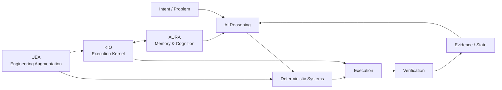

---

# 👋 Joel — systems-focused CSE student

> **GitHub Developer Program Member** — building and experimenting with software that integrates with the GitHub ecosystem. GitHub automatically displays the official Developer Program Member badge on eligible profiles. [Program details](https://docs.github.com/en/integrations/concepts/github-developer-program)

I build **AI systems, developer tools, automation, and experimental software systems** with an emphasis on execution, architecture, verification, and measurable behavior.

> **What should an AI reason about, and what should reliable software do deterministically?**

I learn by shipping, breaking things, measuring them, and then hardening the parts that are worth keeping.

  

---

## 🏗️ Engineering Portfolio

### Architecture at a glance

This is the design boundary running through the portfolio: **reasoning handles ambiguity; deterministic infrastructure owns execution, state, safety, and verification.**

### ⚙️ [gh-ops](https://github.com/aspire488/gh-ops) — Operational Intelligence Platform

A reusable, deterministic GitHub operations layer running on GitHub Actions. gh-ops combines repository, CI, release, and security monitoring with OSS opportunity intelligence, developer activity reporting, persistent state, scheduled workflows, and outbound Telegram notifications.

The system is deliberately **read-only against GitHub**: collection and analysis are automated, while execution boundaries, state, and verification remain deterministic.

`Python` `GitHub Actions` `GitHub API` `Telegram` `State & Events` `OSS Intelligence`

**Current:** Phases 1–8 are implemented, with scheduled GitHub Actions, dedicated CI validation, and Telegram operations live. CI now validates Ruff, mypy, and the full pytest suite on pushes and pull requests, while the operational workflows continue to handle monitoring, intelligence, state, and notifications. The next work is persistent cross-run OSS opportunity state and its notification path.

### 🛠️ [Universal Engineering Augmentation](https://github.com/aspire488/Universal-Engineering-Augmentation) — Public Alpha

Agent-neutral engineering infrastructure for coding agents. UEA moves repeatable engineering work from probabilistic reasoning into deterministic code intelligence, dependency/impact analysis, verification, property/mutation testing, formal reasoning, candidate isolation, routing, provenance, event logging, analytics, and reusable capabilities.

The core stays agent-neutral while integrations can sit beside **OpenCode, Claude Code, Codex, or other coding agents**.

`Python` `Tree-sitter` `Z3` `Hypothesis` `SQLite` `DuckDB` `MCP`

### 🧠 [AURA](https://github.com/aspire488/AURA) — Paused

**Autonomous Unified Reasoning Architecture** — a FastAPI-based memory and cognition backend implementing persistent memory storage/retrieval, cognitive artifacts, and reflection-oriented processing for long-lived agent state.

`Python` `FastAPI` `Memory` `Cognitive Artifacts` `Agents`

### 🤖 [KIO](https://github.com/aspire488/Kio) — Paused after Gate 5

**Kernel for Intelligent Orchestration** — a modular execution kernel that resolves capabilities, plans actions, applies security gates, dispatches providers, executes tools, and verifies resulting state.

KIO turns intent into real actions through:

> **Observe → Reason → Plan → Execute → Verify → Adapt**

It owns capability resolution, provider dispatch, security gates, browser/MCP execution, artifacts, runtime state, recovery, and verification of real side effects.

The repository currently contains **63 validated automation templates** integrated through the canonical KIO execution path.

`Python` `Automation` `Browser Automation` `MCP` `Provider Systems` `Verification`

> **Architecture principle:** AI handles ambiguity and strategy; deterministic software owns execution, safety, state, and verification.

---

## 🧪 Frozen Product Prototypes

These projects are no longer active product-development tracks. They have been hardened into inspectable, reproducible portfolio artifacts.

### ⚡ [CodeFlow](https://github.com/aspire488/codeflow) — Frozen Prototype

Execution-first programming-learning prototype focused on visible execution state, code visualization, exercises, and bounded AI assistance.

**Live:** [codeflow-app-sigma.vercel.app](https://codeflow-app-sigma.vercel.app)

`JavaScript` `Vite` `Execution Visualization` `PWA`

**Final hardening:** Node 22, Vite 8, production-build CI, tagged release validation, Dependabot, CodeQL, deployment security headers, explicit prototype boundary, and MIT licensing.

### 💊 [MediMind Care](https://github.com/aspire488/medimind) — Frozen Prototype

AI-assisted medication-reminder and health-workflow prototype exploring role-specific UX, deterministic reminders, accessibility, synthetic data, and bounded AI assistance.

**Live:** [medimind-seven.vercel.app](https://medimind-seven.vercel.app/)

`React 18` `Vite 6` `Gemini` `Accessibility` `Safety Boundaries`

**Final hardening:** Node 22 CI baseline, Playwright browser smoke coverage, Chromium validation, CodeQL, Dependabot, deployment security headers, environment/credential hygiene, explicit medical safety boundary, and MIT licensing.

The application intentionally remains on its React 18/Vite 6 prototype stack rather than taking an unvalidated framework migration.

---

## 🔗 Project Map

| Project | Stage | Repository | Live / Docs |
|---|---|---|---|
| ⚙️ gh-ops | Operational / Phase 8 | [GitHub](https://github.com/aspire488/gh-ops) | [README](https://github.com/aspire488/gh-ops#readme) |
| 🤖 KIO | Paused after Gate 5 | [GitHub](https://github.com/aspire488/Kio) | [README](https://github.com/aspire488/Kio#readme) |
| 🧠 AURA | Paused | [GitHub](https://github.com/aspire488/AURA) | [Architecture](https://github.com/aspire488/AURA#readme) |
| 🛠️ UEA | Public Alpha | [GitHub](https://github.com/aspire488/Universal-Engineering-Augmentation) | [README](https://github.com/aspire488/Universal-Engineering-Augmentation#readme) |
| ⚡ CodeFlow | Frozen Prototype | [GitHub](https://github.com/aspire488/codeflow) | [Live](https://codeflow-app-sigma.vercel.app) |
| 💊 MediMind | Frozen Prototype | [GitHub](https://github.com/aspire488/medimind) | [Live](https://medimind-seven.vercel.app/) |

---

## 🔀 Open-Source Engineering

I use open source as an external engineering track: working across unfamiliar codebases, contributing real changes, and learning how software is built and maintained outside my own projects.

### Upstream work

I distinguish **merged work from open proposals** so the repository status is explicit.

#### ✅ Merged upstream work

- [aios #2457 — Preserve `length` finish reason across streaming trailers](https://github.com/eumemic/aios/pull/2457)  
  Merged upstream fix preserving provider-reported `finish_reason="length"` when trailing streaming chunks clobber the assembled finish reason, with regression coverage and `content_filter` precedence handling.

#### 🔄 Open upstream PRs

##### Current batch — verified open
- [aios #2458 — Record streaming length as truncated output](https://github.com/eumemic/aios/pull/2458)  
  Records the now-truthful provider-reported `finish_reason="length"` as `output_truncated=true` telemetry at the loop layer, with streaming E2E regression coverage.

- [aios #2459 — Preserve timeout bound in child outcome](https://github.com/eumemic/aios/pull/2459)  
  Preserves whether a workflow child timed out on the deadline or spend ceiling while retaining the existing timeout outcome kind, with regression coverage for both paths.

- [aios #2460 — Preserve LiteLLM parameter translation](https://github.com/eumemic/aios/pull/2460)  
  Prevents the harness from forcing provider-supported parameters such as Anthropic `reasoning_effort` through raw passthrough, while retaining explicit operator allow-lists and unknown-parameter handling.

- [LlamaIndex #23201 — Preserve retrieved scores during prev/next expansion](https://github.com/run-llama/llama_index/pull/23201)  
  Preserves scores from originally retrieved nodes when overlapping `PrevNextNodePostprocessor` expansion encounters the same node, with regression coverage for overlapping expansion, both directions, and zero-score results.

- [IntelliJ PowerShell #506 — Resolve `pwsh.exe` Windows reparse points](https://github.com/intellij-powershell/intellij-powershell/pull/506)  
  Resolves the configured PowerShell executable through `toRealPath()` before launch and adds regression coverage for WindowsApps `pwsh.exe` reparse-point handling.

- [OpenTelemetry Erlang #822 — Isolate Req spans across retries and redirects](https://github.com/open-telemetry/opentelemetry-erlang-contrib/pull/822)  
  Fixes Req client-span state leaking across retries/redirects and adds regression coverage for retry isolation.

- [RisingWave #27181 — Inspect correlated refs in LogicalValues](https://github.com/risingwavelabs/risingwave/pull/27181)  
  Fixes optimizer correlation detection for `LogicalValues` rows and adds regression coverage.

- [MVT #939 — Preserve equals signs in STIX indicator values](https://github.com/mvt-project/mvt/pull/939)  
  Fixes STIX parsing for indicator values containing `=` and adds regression coverage.

- [quiche #2756 — Unify PTO-based timer duration](https://github.com/cloudflare/quiche/pull/2756)  
  Centralizes the 3×PTO timer calculation while preserving existing timer behavior.

- [quiche #2758 — Verify peers when using a custom CA](https://github.com/cloudflare/quiche/pull/2758)  
  Keeps TLS peer verification enabled when `--trust-origin-ca-pem` supplies a custom CA, while preserving the explicit `--no-verify` opt-out.

- [quiche #2759 — Ignore ACKs for non-in-flight packets](https://github.com/cloudflare/quiche/pull/2759)  
  Preserves in-flight state through legacy congestion-control ACK metadata and prevents Reno from growing its congestion window for non-in-flight packets.

- [Coder #29668 — Deduplicate `Unknown` AI Gateway clients](https://github.com/coder/coder/pull/29668)  
  Groups nullable and literal `Unknown` client values by displayed identity and adds regression coverage.

- [AI Platform AWS #4 — Direct Anthropic provider routing](https://github.com/tysoncung/ai-platform-aws/pull/4)  
  Fixes provider-resolution precedence when direct Anthropic and generic Bedrock Claude routing both apply.

- [OpenHands #17579 — Validate condenser max size](https://github.com/OpenHands/OpenHands/pull/17579)  
  Adds validation and regression coverage for negative condenser max-size values while preserving zero as valid.

- [AgentBench #8 — Add global command palette](https://github.com/PicadoLabs/agent-bench/pull/8)  
  Adds global command navigation, fuzzy search, keyboard interaction, accessibility semantics, and architecture documentation.

- [GoalAI #1 — Prediction Intelligence Lab](https://github.com/adityamallia7/GoalAI-Score-predictor-26/pull/1)  
  Adds reproducible seeded Monte Carlo analysis, sensitivity/stability metrics, tests, and documentation.

- [N3MO #39 — Language routing and parser regression coverage](https://github.com/RajX-dev/N3MO/pull/39)  
  Adds regression coverage for Ruby/Kotlin parser loading, extension routing, and symbol extraction.

- [PyRIT #2762 — Dataset summary API](https://github.com/microsoft/PyRIT/pull/2762)  
  Adds a memory-backed dataset summary path with logical-example, seed-piece, objective, modality, and harm-category metadata, plus focused unit coverage.

- [KiroCrew #12861 — Restore PDF search behind bounded extraction](https://github.com/kirodotdev/KiroCrew/pull/12861)  
  Restores PDF content search while routing pdfplumber through a disposable, resource-limited extractor shared with knowledge ingestion. Adds bounded extraction, failure/truncation handling, and focused regression coverage.

- [GitHub Profile Analyzer #30 — Evidence-weighted impact scoring](https://github.com/0xarchit/github-profile-analyzer/pull/30)  
  Refines deterministic impact scoring around independent project evidence such as releases, downloads, homepage, README/license/CI/tests coverage, with regression coverage for strong project evidence.

#- [GitHub Profile Analyzer — Impact score evidence weighting](https://github.com/0xarchit/github-profile-analyzer/compare/main...aspire488:fix/impact-score-evidence)  
  Refines the deterministic Impact score so adoption signals (stars/forks) are balanced with independent project evidence such as releases, release downloads, homepage, README/license/CI/tests coverage. Added deterministic regression coverage for strong project evidence with zero stars/forks. The change is open for upstream review.

#### 🧪 In progress

- [uutils/coreutils #14812 — Preserve canonical quoting style in `ls --dired` metadata](https://github.com/uutils/coreutils/pull/14812)  
  Preserves the canonical quoting-style name used by `ls --dired` and adds regression coverage for named styles and short aliases.

- [Cognee #4957 — Detect active agent connections](https://github.com/aspire488/cognee/tree/fix/4957-active-agent-status)  
  Implements active-connection detection in the dashboard/integrations hook with focused regression coverage. The fix remains on the fork branch pending upstream PR creation.

- [Cognee telemetry follow-up — validation branch](https://github.com/aspire488/cognee/tree/fix/telemetry-error-type)  
  Explored a narrow pipeline error-type telemetry fix, then verified it overlaps with existing upstream telemetry work (#5159). It is therefore **not listed as an upstream contribution**.

##### Recent OSS validation — September 2026

The aios contribution sequence now includes one merged upstream fix (#2457) followed by three scoped follow-ups (#2458, #2459, #2460), each separated by issue scope and regression coverage.

The latest local validation pass covered four repositories with focused fixes/regression coverage and remote PR updates:

- [uutils/coreutils #14812](https://github.com/uutils/coreutils/pull/14812) — validated the `ls --dired` quoting-style changes; local formatting, check, clippy, and diff validation passed. One upstream test remains for maintainer/CI follow-up.
- [PyRIT #2762](https://github.com/microsoft/PyRIT/pull/2762) — addressed dataset-summary review feedback with collation-safe grouping, unnamed dataset handling, distinct selection keys, fixture ordering, and a loaded-only memory view; full unit suite passed locally.
- [N3MO #39](https://github.com/RajX-dev/N3MO/pull/39) — fixed Kotlin call-target extraction exposed by the real AST regression test; targeted Ruby/Kotlin tests passed.
- [OpenHands #17579](https://github.com/OpenHands/OpenHands/pull/17579) — aligned condenser max-size metadata with the agent-server minimum, updated persistence mocks/tests, and passed focused tests, ESLint, TypeScript, and Prettier validation.

> Local validation is reported separately from upstream CI; platform-specific or maintainer-side checks remain the responsibility of the upstream project.

#### Earlier upstream work

- [Clicky #72 — Contributor quickstart revamp](https://github.com/daniel5151/clicky/pull/72)  
  Emulator contributor workflow covering boot paths, safe disk-image setup, firmware smoke tests, troubleshooting, and development handoff.

#### 💬 Community technical discussions

- [Lexical #8771 — Named Slots for paginated editors](https://github.com/facebook/lexical/discussions/8771)  
  Discussed separating page-region modeling from pagination/flow logic.

- [MCP Registry #921 — Using the published Docker image](https://github.com/modelcontextprotocol/registry/discussions/921)  
  Explained the GHCR image workflow and PostgreSQL-backed deployment model.

- [VS Code Discussions #3109 — Diagnosing Electron main-process hangs](https://github.com/microsoft/vscode-discussions/discussions/3109)  
  Proposed an incident-diagnostics workflow around watchdogs, event-loop health, Node diagnostic reports, process dumps, profiling, and IPC telemetry.

- [MVT Discussions — STIX indicator parsing](https://github.com/mvt-project/mvt/discussions)  
  Discussed whether MVT should keep lightweight STIX parsing or introduce a small explicit parsing/validation boundary for malformed and edge-case indicator values.

- [OpenAI Codex #46658 — Beyond Auto mode: adaptive allocation](https://github.com/openai/codex/discussions/46658)  
  Discussed evidence-driven allocation of models, reasoning effort, tools, and subagents, including reassessment triggers, effective inherited configuration, rerouting observability, verification boundaries, and attributable compute cost.

> **Selected, not exhaustive.** This section intentionally distinguishes **proposed upstream work** from **accepted/merged work**. Discussion participation is listed separately from code contributions.

 This section favors substantive engineering work over activity-count inflation.

**Open-source contribution history:** [View my PRs across GitHub](https://github.com/pulls?q=is%3Apr%20author%3Aaspire488)

---

## 💬 Technical Discussions

I also contribute through **GitHub Discussions** — answering concrete engineering questions in unfamiliar codebases and sharing implementation-level reasoning with maintainers and other developers.

### Recent discussions

- 🧩 [Lexical #8771 — Named Slots for paginated editors](https://github.com/facebook/lexical/discussions/8771)  
  Discussed separating **page-region modeling** from **pagination/flow logic**, using Named Slots for independently editable header/footer regions while keeping content pagination as a higher-level layout concern.

- 🐳 [MCP Registry #921 — Using the published Docker image](https://github.com/modelcontextprotocol/registry/discussions/921)  
  Explained the GHCR image workflow, the distinction between the pre-built Registry image and the full local development environment, and the PostgreSQL dependency for persistent deployments.

- ⚡ [VS Code Discussions #3109 — Diagnosing Electron main-process hangs](https://github.com/microsoft/vscode-discussions/discussions/3109)  
  Proposed a practical incident-diagnostics workflow around external watchdogs, event-loop health, Node diagnostic reports, process dumps, CPU profiling, IPC telemetry, and separating JavaScript starvation from synchronous/native/OS blocking.

- 🧩 [MVT Discussions — STIX indicator parsing](https://github.com/mvt-project/mvt/discussions)  
  Discussed the parsing boundary around STIX indicators, including values containing `=`, malformed patterns, validation, and preserving existing detection semantics.

> Discussion answers are kept focused on reproducible engineering practices, implementation details, and primary documentation rather than activity for its own sake.

---

## 🧠 Engineering Principles

- **Deterministic software owns execution; AI handles ambiguity.**
- **Verification is part of implementation, not a final step.**
- **Measure behavior before claiming improvement.**

---

## 🛠️ Stack

<strong>Languages</strong> 

  
<strong>Frameworks & Platforms</strong> 

  
<strong>Tools & Infrastructure</strong> 

---

## 🏷️ Technologies & Tools

<strong>Languages</strong> 

<strong>Systems & Frameworks</strong> 

<strong>Engineering & Infrastructure</strong> 

<strong>AI / Developer Workflow</strong> 

> These badges describe the technologies currently represented in my public projects and engineering workflow — they are not certification badges.

---

## 📊 GitHub Activity

<picture>
  <source media="(prefers-color-scheme: dark)" srcset="./assets/profile/overview.dark.svg" />
  <source media="(prefers-color-scheme: light)" srcset="./assets/profile/overview.light.svg" />
  
</picture>

<picture>
  <source media="(prefers-color-scheme: dark)" srcset="./assets/profile/contributions.dark.svg" />
  <source media="(prefers-color-scheme: light)" srcset="./assets/profile/contributions.light.svg" />
  
</picture>

<picture>
  <source media="(prefers-color-scheme: dark)" srcset="./assets/profile/lifetime.dark.svg" />
  <source media="(prefers-color-scheme: light)" srcset="./assets/profile/lifetime.light.svg" />
  
</picture>

<picture>
  <source media="(prefers-color-scheme: dark)" srcset="./assets/profile/languages.dark.svg" />
  <source media="(prefers-color-scheme: light)" srcset="./assets/profile/languages.light.svg" />
  
</picture>

<picture>
  <source media="(prefers-color-scheme: dark)" srcset="./assets/profile/rhythm.dark.svg" />
  <source media="(prefers-color-scheme: light)" srcset="./assets/profile/rhythm.light.svg" />
  
</picture>

<picture>
  <source media="(prefers-color-scheme: dark)" srcset="./assets/profile/composition.dark.svg" />
  <source media="(prefers-color-scheme: light)" srcset="./assets/profile/composition.light.svg" />
  
</picture>

> Activity cards are generated by GitHub Actions and committed to this profile repository, avoiding fragile third-party statistics endpoints.

---

## 🎯 Current Direction

| Track | State / next milestone |
|---|---|
| ⚙️ gh-ops | Phase 8 operational hardening + OSS persistence |
| 🤖 KIO | Paused after Gate 5 completion |
| 🧠 AURA | Paused; core cognition architecture checkpoint complete |
| 🛠️ UEA | Public alpha + reusable engineering infrastructure |
| ⚡ CodeFlow | Frozen, hardened prototype |
| 💊 MediMind | Frozen, hardened prototype |
| 🌍 Open Source | Cross-project contributions + upstream engineering |

---

<strong>Building in public • Shipping real systems • Learning by doing</strong>

