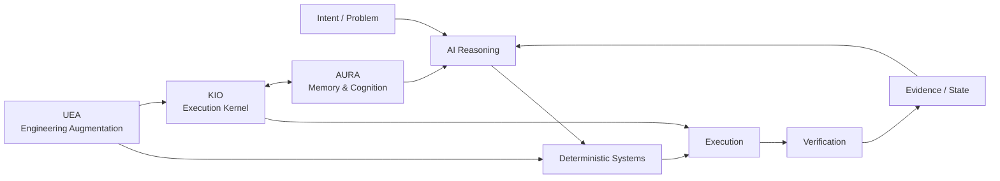
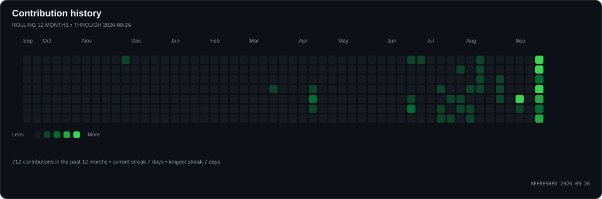

---

# 👋 Joel — systems-focused CSE student

> **GitHub Developer Program Member** — building and experimenting with software that integrates with the GitHub ecosystem. GitHub automatically displays the official Developer Program Member badge on eligible profiles. [Program details](https://docs.github.com/en/integrations/concepts/github-developer-program)

I build **AI systems, developer tools, automation, and experimental software systems** with an emphasis on execution, architecture, verification, and measurable behavior.

> **What should an AI reason about, and what should reliable software do deterministically?**

I learn by shipping, breaking things, measuring them, and then hardening the parts that are worth keeping.

> **2026 contribution milestone:** 500+ GitHub contributions, alongside ongoing upstream and fork-side engineering work.

### 🏆 Standout Upstream Milestone — Microsoft PyRIT

> **Three merged upstream contributions to Microsoft PyRIT**
>
> **#2762 — Dataset Summary API — MERGED UPSTREAM · September 24, 2026**
>
> Added memory-backed dataset summaries and survived multiple maintainer review rounds covering aggregation semantics, dataset identity, SQLite behavior, selection-key isolation, metadata query sizing, and `loaded_only` behavior before landing upstream.
>
> **Merge commit:** `47c6151a`
>
> >
> **#2823 — HarmBench context preservation — MERGED UPSTREAM · September 25, 2026**
>
> Preserves non-empty HarmBench `ContextString` in behavior prompts, retains context metadata, and adds regression coverage.
>
> **Merge commit:** `940a8efabb404d80f6a716c5e641d81809d8972a`
>
> **Track record:** three separate upstream PRs merged into Microsoft's open-source AI red-teaming framework, spanning feature work, backend behavior, and regression-focused fixes.

  

---

## 🏗️ Engineering Portfolio

### Architecture at a glance

This is the design boundary running through the portfolio: **reasoning handles ambiguity; deterministic infrastructure owns execution, state, safety, and verification.**

### ⚙️ [gh-ops](https://github.com/aspire488/gh-ops) — Operational Intelligence Platform

A reusable, deterministic GitHub operations layer running on GitHub Actions. gh-ops combines repository, CI, release, and security monitoring with OSS opportunity intelligence, developer activity reporting, persistent state, scheduled workflows, and outbound Telegram notifications.

The system is deliberately **read-only against GitHub**: collection and analysis are automated, while execution boundaries, state, and verification remain deterministic.

`Python` `GitHub Actions` `GitHub API` `Telegram` `State & Events` `OSS Intelligence`

**Current:** Phases 1–8 and the post-Phase-8 hardening line are implemented. The current system combines repository/CI/release monitoring, OSS intelligence, security intelligence, developer activity, persistent event/repository lifecycles, unified reporting, and scheduled Telegram operations. The latest baseline is **1,260 tests passing**, including **35 Telegram transport-boundary contract tests**. Telegram behavior is verified for severity, priority, topic routing, no-op silence, at-least-once delivery, recovery, and MarkdownV2 payload safety.

### 🛠️ [Universal Engineering Augmentation](https://github.com/aspire488/Universal-Engineering-Augmentation) — Public Alpha

Agent-neutral engineering infrastructure for coding agents. UEA moves repeatable engineering work from probabilistic reasoning into deterministic code intelligence, dependency/impact analysis, verification, property/mutation testing, formal reasoning, candidate isolation, routing, provenance, event logging, analytics, and reusable capabilities.

The core stays agent-neutral while integrations can sit beside **OpenCode, Claude Code, Codex, or other coding agents**.

`Python` `Tree-sitter` `Z3` `Hypothesis` `SQLite` `DuckDB` `MCP`

### 🧠 [AURA](https://github.com/aspire488/AURA) — Architecture checkpoint

**Autonomous Unified Reasoning Architecture** — a FastAPI-based memory and cognition backend implementing persistent memory storage/retrieval, cognitive artifacts, and reflection-oriented processing for long-lived agent state.

`Python` `FastAPI` `Memory` `Cognitive Artifacts` `Agents`

### 🤖 [KIO](https://github.com/aspire488/Kio) — Gate 5 complete · Maintenance

**Kernel for Intelligent Orchestration** — a modular execution kernel that resolves capabilities, plans actions, applies security gates, dispatches providers, executes tools, and verifies resulting state.

KIO turns intent into real actions through:

> **Observe → Reason → Plan → Execute → Verify → Adapt**

It owns capability resolution, provider dispatch, security gates, browser/MCP execution, artifacts, runtime state, recovery, and verification of real side effects.

The repository currently contains **63 validated automation templates** integrated through the canonical KIO execution path.

`Python` `Automation` `Browser Automation` `MCP` `Provider Systems` `Verification`

> **Architecture principle:** AI handles ambiguity and strategy; deterministic software owns execution, safety, state, and verification.

---

## 🧪 Frozen Product Prototypes

These projects are no longer active product-development tracks. They have been hardened into inspectable, reproducible portfolio artifacts.

### ⚡ [CodeFlow](https://github.com/aspire488/codeflow) — Frozen Prototype

Execution-first programming-learning prototype focused on visible execution state, code visualization, exercises, and bounded AI assistance.

**Live:** [codeflow-app-sigma.vercel.app](https://codeflow-app-sigma.vercel.app)

`JavaScript` `Vite` `Execution Visualization` `PWA`

**Final hardening:** Node 22, Vite 8, production-build CI, tagged release validation, Dependabot, CodeQL, deployment security headers, explicit prototype boundary, and MIT licensing.

### 💊 [MediMind Care](https://github.com/aspire488/medimind) — Frozen Prototype

AI-assisted medication-reminder and health-workflow prototype exploring role-specific UX, deterministic reminders, accessibility, synthetic data, and bounded AI assistance.

**Live:** [medimind-seven.vercel.app](https://medimind-seven.vercel.app/)

`React 18` `Vite 6` `Gemini` `Accessibility` `Safety Boundaries`

**Final hardening:** Node 22 CI baseline, Playwright browser smoke coverage, Chromium validation, CodeQL, Dependabot, deployment security headers, environment/credential hygiene, explicit medical safety boundary, and MIT licensing.

The application intentionally remains on its React 18/Vite 6 prototype stack rather than taking an unvalidated framework migration.

---

## 🔗 Project Map

| Project | Stage | Repository | Live / Docs |
|---|---|---|---|
| ⚙️ gh-ops | Operational / Final hardening | [GitHub](https://github.com/aspire488/gh-ops) | [README](https://github.com/aspire488/gh-ops#readme) |
| 🤖 KIO | Gate 5 complete · Maintenance | [GitHub](https://github.com/aspire488/Kio) | [README](https://github.com/aspire488/Kio#readme) |
| 🧠 AURA | Architecture checkpoint | [GitHub](https://github.com/aspire488/AURA) | [Architecture](https://github.com/aspire488/AURA#readme) |
| 🛠️ UEA | Public Alpha | [GitHub](https://github.com/aspire488/Universal-Engineering-Augmentation) | [README](https://github.com/aspire488/Universal-Engineering-Augmentation#readme) |
| ⚡ CodeFlow | Frozen Prototype | [GitHub](https://github.com/aspire488/codeflow) | [Live](https://codeflow-app-sigma.vercel.app) |
| 💊 MediMind | Frozen Prototype | [GitHub](https://github.com/aspire488/medimind) | [Live](https://medimind-seven.vercel.app/) |

---

## 🗺️ OSS Atlas

> The complete open-source engineering archive now lives in **[OSS Atlas](https://github.com/aspire488/oss-atlas)** — contribution records, upstream work, research, case studies, experiments, learnings, and the spatial/3D engineering track.

## 🔀 Open-Source Engineering

I use open source as an external engineering track: working across unfamiliar codebases, contributing real changes, and learning how software is built and maintained outside my own projects.

### Upstream work

I distinguish **merged work from open proposals** so the repository status is explicit.

#### ✅ Merged upstream work
- [PyRIT #2762 — Dataset Summary API](https://github.com/microsoft/PyRIT/pull/2762)  
  **Merged upstream on September 24, 2026** after maintainer review and multiple refinement rounds. Added memory-backed dataset summaries with aggregation, selection-key isolation, unnamed/whitespace dataset handling, metadata query controls, `loaded_only` behavior, and regression coverage. Final merge commit: `47c6151a`.

- [aios #2458 — Record streaming `length` as truncated output](https://github.com/eumemic/aios/pull/2458)  
  **Merged upstream on September 24, 2026** after the maintainer resolved the pinned Ruff formatting blocker. The final implementation records provider `finish_reason="length"` as `output_truncated=true` at the loop layer and includes streaming regression coverage. Merge commit: `fe051b2c`. 

- [aios #2457 — Preserve `length` finish reason across streaming trailers](https://github.com/eumemic/aios/pull/2457)  
  Merged upstream fix preserving provider-reported `finish_reason="length"` when trailing streaming chunks clobber the assembled finish reason, with regression coverage and `content_filter` precedence handling.

- [aios #2460 — Preserve LiteLLM parameter translation](https://github.com/eumemic/aios/pull/2460)  
  Merged upstream fix that preserves LiteLLM provider-specific parameter translation while retaining explicit `allowed_openai_params` overrides, with regression coverage for mapped, unmapped, and explicitly forced parameters.

- [aios #2459 — Preserve timeout bound in child outcome](https://github.com/eumemic/aios/pull/2459)  
  **Merged upstream** after maintainer review. Preserves whether workflow-child timeout resolution came from the `deadline` or `spend` bound while keeping `kind="timeout"` unchanged for compatibility, with regression coverage for both trigger paths.

- [GitHub Profile Analyzer #30 — Evidence-weighted impact scoring](https://github.com/0xarchit/github-profile-analyzer/pull/30)  
  **Merged upstream** after maintainer approval. Refined impact scoring with repository-quality evidence and improved viewport-aware factor tooltips, with regression coverage.

- [PyRIT #2823 — Preserve HarmBench contextual behavior prompts](https://github.com/microsoft/PyRIT/pull/2823)  
  **Merged upstream on September 25, 2026.** Preserves non-empty HarmBench ContextString in behavior prompts, retains context metadata, and adds regression coverage. Merge commit: `940a8efabb404d80f6a716c5e641d81809d8972a`.

### 🟡 Open upstream work

- [AgentField #1073 — Go harness factory tests](https://github.com/Agent-Field/agentfield/pull/1073)  
  **Open upstream · September 25, 2026.** Adds focused `factory_test.go` coverage for explicit Claude Code and OpenCode provider construction, extending the existing default/environment/unknown-provider coverage from issue #404.

- [NousResearch Hermes Agent #121771 — Desktop gateway stale-ref recovery](https://github.com/NousResearch/hermes-agent/pull/121771)  
  **Open upstream.** Adds active-gateway fallback plus stale-open/closed-socket recovery and focused reconnect regression coverage. The PR remains under maintainer review.

## 📡 Current OSS PR Queue — September 25, 2026

| Repository | PR | Status | Engineering focus |
|---|---|---|---|
| Microsoft PyRIT | [#2762](https://github.com/microsoft/PyRIT/pull/2762) | ✅ Merged | Dataset Summary API; merged upstream September 24, 2026 |
| Microsoft PyRIT | [#2823](https://github.com/microsoft/PyRIT/pull/2823) | ✅ Merged | HarmBench ContextString preservation with regression coverage; merged upstream September 25, 2026 |
| NousResearch Hermes Agent | [#121771](https://github.com/NousResearch/hermes-agent/pull/121771) | 🟡 Open | Recover from stale desktop gateway refs and closed sockets; focused reconnect regression coverage |
| RisingWave | [#27181](https://github.com/risingwavelabs/risingwave/pull/27181) | 🟡 Open | Correlated refs inside LogicalValues; real LogicalApply → ApplyEliminateRule → to_batch() regression |
| SiYuan | [#1](https://github.com/aspire488/siyuan/pull/1) | 🟡 Open | Recover expired MCP sessions with exactly one safe replay |
| TopoCore | [#1](https://github.com/KARAN-D05/TopoCore/pull/1) | 🟡 Open | Deterministic spatial execution cycle detection |
| Inspect AI | [#1](https://github.com/aspire488/inspect_ai/pull/1) | 🟡 Open | Base64-safe Google inline-image bytes |
| MVT | [#939](https://github.com/mvt-project/mvt/pull/939) | 🟡 Open | STIX indicator parsing with = inside URL query values |
| Cloudflare quiche | [#2759](https://github.com/cloudflare/quiche/pull/2759) | 🟡 Open | Ignore ACKs for non-in-flight packets in Reno |
| Cloudflare quiche | [#2758](https://github.com/cloudflare/quiche/pull/2758) | 🟡 Open | Verify peers when using a custom CA |
| Cloudflare quiche | [#2756](https://github.com/cloudflare/quiche/pull/2756) | 🟡 Draft | Unify PTO-based timer duration |
| GitHub Linguist | [#1](https://github.com/aspire488/linguist/pull/1) | 🟡 Open | Trim .example suffix before language detection |
| AI Platform AWS | [#4](https://github.com/tysoncung/ai-platform-aws/pull/4) | 🟡 Open | Provider-routing specificity for Anthropic vs Bedrock Claude |
| Agent-Bench | [#8](https://github.com/PicadoLabs/agent-bench/pull/8) | 🟡 Open | Global command palette with keyboard/accessibility support |
| GoalAI Score Predictor | [#1](https://github.com/adityamallia7/GoalAI-Score-predictor-26/pull/1) | 🟡 Open | Reproducible Monte Carlo prediction-analysis lab; deployment awaiting Vercel authorization |
| AgentField | [#1073](https://github.com/Agent-Field/agentfield/pull/1073) | 🟡 Open | Go SDK harness factory regression coverage; closes the `factory_test.go` slice of #404 |
| OpenHands | [#17579](https://github.com/OpenHands/OpenHands/pull/17579) | 🟡 Open | Align condenser max-size metadata with agent-server minimum |
| LlamaIndex | [#23201](https://github.com/run-llama/llama_index/pull/23201) | 🟡 Open | Preserve retrieved scores during previous/next expansion |
| IntelliJ PowerShell | [#506](https://github.com/intellij-powershell/intellij-powershell/pull/506) | 🟡 Open | Resolve pwsh.exe WindowsApps reparse points |
| OpenTelemetry Erlang | [#822](https://github.com/open-telemetry/opentelemetry-erlang-contrib/pull/822) | 🟡 Open | Isolate spans across retries and redirects |
| Coder | [#29668](https://github.com/coder/coder/pull/29668) | 🟡 Draft | Deduplicate unknown AI Gateway clients |
| N3MO | [#39](https://github.com/RajX-dev/N3MO/pull/39) | 🟡 Open | Ruby/Kotlin language routing regression coverage |
| garak | [#1](https://github.com/aspire488/garak/pull/1) | 🟡 Open | Unset soft prompt cap handling |

**Review posture:** no fabricated activity. PRs without actionable maintainer feedback remain waiting; concrete reviewer findings are patched when verified.
## 🛡️ PyRIT — AI Red-Teaming Contributions

I’m actively contributing to **[Microsoft PyRIT](https://github.com/microsoft/PyRIT)**, an open-source framework for AI red teaming. My recent upstream work includes two merged PyRIT upstream contributions: the dataset-summary API (#2762) and HarmBench context preservation (#2823).

### 🔥 Current PyRIT work

- **[#2762 — Dataset Summary API](https://github.com/microsoft/PyRIT/pull/2762)** — **🏆 MERGED UPSTREAM · September 24, 2026** after maintainer review. Added memory-backed dataset summaries and iterated through feedback covering aggregation, SQLite collation behavior, unnamed/whitespace dataset identity, selection-key isolation, metadata query size, and `loaded_only` behavior. Roman Lutz verified the substantive concerns against real stored seeds, and the final test-cleanup commit was merged with the implementation. Merge commit: `47c6151a`.
- **[#2823 — Preserve HarmBench contextual behavior prompts](https://github.com/microsoft/PyRIT/pull/2823)** — **🏆 MERGED UPSTREAM · September 25, 2026**. Fixes the HarmBench loader dropping non-empty `ContextString` values by combining context and behavior using the dataset convention, while retaining context in metadata and adding regression coverage. Merge commit: `940a8efabb404d80f6a716c5e641d81809d8972a`.
- **[#2782 — Canonical technique names in scenario run summaries](https://github.com/aspire488/PyRIT/tree/fix/promptinject-technique-summary)** — follow-up fix prepared on my fork. Corrects `techniques_used` to use the persisted canonical `technique_name` rather than a potentially goal/objective-bearing `display_group`, with regression coverage. The fork PR is open while an upstream submission path is being finalized.

> **Why it matters:** this work involves navigating a large unfamiliar codebase, understanding existing data models and service boundaries, responding to maintainer review, and adding targeted regression coverage rather than making isolated demo changes.

**Status is intentionally explicit:** #2762 is merged upstream; #2823 is open upstream for maintainer review; #2782 remains fork-side work until an upstream PR exists.

---

### 🧪 Microsoft RAMPART — Agentic AI Security Testing

**[Microsoft RAMPART](https://github.com/microsoft/RAMPART)** is a pytest-native safety and security testing framework for agentic AI applications, built around repeatable adversarial testing and evaluation-driven assertions. It extends the same AI-security direction as the PyRIT work above into agent-focused regression testing and CI.

> **Next AI-security target:** RAMPART is tracked here as a target project, not as a claimed contribution or merged PR.

`Python` `Pytest` `AI Security` `Red Teaming` `Agentic AI`
### 🌀 TopoCore — Spatial Execution Contribution

- **[TopoCore — cycle detection for spatial execution](https://github.com/KARAN-D05/TopoCore/pull/1)** — added deterministic cycle detection to the experimental 2D spatial execution visualizer by tracking `(X, Y, Direction)` states, stopping repeated execution loops, and resetting execution-trace state on reset/clear. This explores an unconventional execution model where program flow is defined by movement through symbolic space.

### 🆕 AI-security OSS contributions — September 23–24, 2026

- **Microsoft PyRIT #2762** — **merged upstream** after maintainer review; dataset summary API with memory-backed aggregation and regression coverage.
- **NVIDIA garak #1** — fork-side fix for `IterativeProbe` when `soft_probe_prompt_cap=None`, preserving uncapped behavior and adding regression coverage.
- **UK AI Security Institute Inspect AI #1** — fork-side fix for Google inline-image conversion for raw binary `Blob.data` by base64-encoding bytes before building the data URI.

> Status is tracked explicitly: merged upstream work is separated from open fork-side proposals.

### 🔥 Latest engineering work — September 25, 2026

- **Microsoft PyRIT #2762** — **merged upstream** after multiple maintainer review rounds. The dataset summary API is now part of upstream PyRIT; final merge commit: `47c6151a`.
- **Microsoft PyRIT #2823** — **merged upstream on September 25, 2026**. Preserves non-empty HarmBench `ContextString` values while retaining context metadata, with focused regression coverage. Merge commit: `940a8efabb404d80f6a716c5e641d81809d8972a`.
- **aios #2458** — **merged upstream on September 24, 2026**. The streaming truncation telemetry fix landed in master after the pinned Ruff formatting issue was resolved. Merge commit: `fe051b2c`.
- **RisingWave #27181** — **open upstream**. Correlated-reference coverage now crosses the real `LogicalApply → ApplyEliminateRule → to_batch()` path, including a multi-row `LogicalValues` case; the review-found test compile issue was fixed with `ctx.clone()`.
- **KiroCrew #12861** — **closed without merge on September 25, 2026**; superseded by upstream #12925, which already contained the fix.
- **TopoCore #1** — **open upstream**. Added deterministic repeated-state cycle detection to the spatial execution simulator.
- **LlamaIndex #23201** — **open upstream**. Preserves retrieved scores during previous/next expansion.
- **OpenHands #17579** — **open upstream**. Aligns condenser max-size metadata with the agent-server minimum.
- **OpenTelemetry Erlang #822** — **open upstream**. Isolates spans across retries and redirects.
- **Coder #29668** — **open upstream**. Deduplicates unknown AI Gateway clients.
- **Cloudflare quiche #2758 / #2759** — **open upstream** fixes covering custom-CA peer verification and Reno ACK accounting.
- **IntelliJ PowerShell #506** — **open upstream** fix for resolving `pwsh.exe` through WindowsApps reparse points.
- **N3MO #39** — **open upstream** regression coverage for Ruby and Kotlin language routing.

> Status is deliberately separated into merged, open-upstream, and fork-side work. No open proposal is presented as accepted upstream.

---

---

## 💬 Technical Discussions

I also contribute through **GitHub Discussions** — answering concrete engineering questions in unfamiliar codebases and sharing implementation-level reasoning with maintainers and other developers.

### Recent discussions

- 🧩 [Lexical #8771 — Named Slots for paginated editors](https://github.com/facebook/lexical/discussions/8771)  
  Discussed separating **page-region modeling** from **pagination/flow logic**, using Named Slots for independently editable header/footer regions while keeping content pagination as a higher-level layout concern.

- 🐳 [MCP Registry #921 — Using the published Docker image](https://github.com/modelcontextprotocol/registry/discussions/921)  
  Explained the GHCR image workflow, the distinction between the pre-built Registry image and the full local development environment, and the PostgreSQL dependency for persistent deployments.

- ⚡ [VS Code Discussions #3109 — Diagnosing Electron main-process hangs](https://github.com/microsoft/vscode-discussions/discussions/3109)  
  Proposed a practical incident-diagnostics workflow around external watchdogs, event-loop health, Node diagnostic reports, process dumps, CPU profiling, IPC telemetry, and separating JavaScript starvation from synchronous/native/OS blocking.

- 🧩 [MVT Discussions — STIX indicator parsing](https://github.com/mvt-project/mvt/discussions)  
  Discussed the parsing boundary around STIX indicators, including values containing `=`, malformed patterns, validation, and preserving existing detection semantics.

> Discussion answers are kept focused on reproducible engineering practices, implementation details, and primary documentation rather than activity for its own sake.

---

## 🧠 Engineering Principles

- **Deterministic software owns execution; AI handles ambiguity.**
- **Verification is part of implementation, not a final step.**
- **Measure behavior before claiming improvement.**

---

## 🛠️ Stack

<strong>Languages</strong> 

  
<strong>Frameworks & Platforms</strong> 

  
<strong>Tools & Infrastructure</strong> 

---

## 🏷️ Technologies & Tools

<strong>Languages</strong> 

<strong>Systems & Frameworks</strong> 

<strong>Engineering & Infrastructure</strong> 

<strong>AI / Developer Workflow</strong> 

> These badges describe the technologies currently represented in my public projects and engineering workflow — they are not certification badges.

---

## 📊 GitHub Activity

<picture>
  <source media="(prefers-color-scheme: dark)" srcset="./assets/profile/overview.dark.svg" />
  <source media="(prefers-color-scheme: light)" srcset="./assets/profile/overview.light.svg" />
  
</picture>

<picture>
  <source media="(prefers-color-scheme: dark)" srcset="./assets/profile/contributions.dark.svg" />
  <source media="(prefers-color-scheme: light)" srcset="./assets/profile/contributions.light.svg" />
  
</picture>

<picture>
  <source media="(prefers-color-scheme: dark)" srcset="./assets/profile/activity.dark.svg" />
  <source media="(prefers-color-scheme: light)" srcset="./assets/profile/activity.light.svg" />
  
</picture>

<picture>
  <source media="(prefers-color-scheme: dark)" srcset="./assets/profile/languages.dark.svg" />
  <source media="(prefers-color-scheme: light)" srcset="./assets/profile/languages.light.svg" />
  
</picture>

<picture>
  <source media="(prefers-color-scheme: dark)" srcset="./assets/profile/rhythm.dark.svg" />
  <source media="(prefers-color-scheme: light)" srcset="./assets/profile/rhythm.light.svg" />
  
</picture>

<picture>
  <source media="(prefers-color-scheme: dark)" srcset="./assets/profile/composition.dark.svg" />
  <source media="(prefers-color-scheme: light)" srcset="./assets/profile/composition.light.svg" />
  
</picture>

> Activity cards are generated by GitHub Actions and committed to this profile repository, avoiding fragile third-party statistics endpoints.

> **Project status note — September 24, 2026:** KIO has completed Gate 5 and is currently in a maintenance/security-documentation state; recent commits are cleanup and hardening rather than a restart of feature development. AURA remains at its June 2026 architecture checkpoint with no active feature-development line.

---

## 🎯 Current Direction

| Track | State / next milestone |
|---|---|
| ⚙️ gh-ops | **Final hardening complete** — 1,260 tests passing; operational baseline
| 🤖 KIO | **Gate 5 complete · maintenance** — latest activity is security/documentation cleanup and hardening |
| 🧠 AURA | **Architecture checkpoint** — core cognition architecture is complete; no active feature-development line |
| 🛠️ UEA | Public alpha + reusable engineering infrastructure |
| ⚡ CodeFlow | Frozen, hardened prototype |
| 💊 MediMind | Frozen, hardened prototype |
| 🌍 Open Source | Cross-project contributions + upstream engineering |

---

<strong>Building in public • Shipping real systems • Learning by doing</strong>

