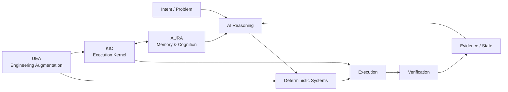

---

# 👋 Joel — systems-focused CSE student

> **GitHub Developer Program Member** — building and experimenting with software that integrates with the GitHub ecosystem. GitHub automatically displays the official Developer Program Member badge on eligible profiles. [Program details](https://docs.github.com/en/integrations/concepts/github-developer-program)

I build **AI systems, developer tools, automation, and experimental software systems** with an emphasis on execution, architecture, verification, and measurable behavior.

> **What should an AI reason about, and what should reliable software do deterministically?**

I learn by shipping, breaking things, measuring them, and then hardening the parts that are worth keeping.

> **2026 contribution milestone:** 500+ GitHub contributions, alongside ongoing upstream and fork-side engineering work.

  

---

## 🏗️ Engineering Portfolio

### Architecture at a glance

This is the design boundary running through the portfolio: **reasoning handles ambiguity; deterministic infrastructure owns execution, state, safety, and verification.**

### ⚙️ [gh-ops](https://github.com/aspire488/gh-ops) — Operational Intelligence Platform

A reusable, deterministic GitHub operations layer running on GitHub Actions. gh-ops combines repository, CI, release, and security monitoring with OSS opportunity intelligence, developer activity reporting, persistent state, scheduled workflows, and outbound Telegram notifications.

The system is deliberately **read-only against GitHub**: collection and analysis are automated, while execution boundaries, state, and verification remain deterministic.

`Python` `GitHub Actions` `GitHub API` `Telegram` `State & Events` `OSS Intelligence`

**Current:** Phases 1–8 are implemented, with scheduled GitHub Actions, dedicated CI validation, and Telegram operations live. CI validates Ruff, mypy, and the full pytest suite on pushes and pull requests. The latest CI hardening fixed an editable-install failure caused by an unsupported setuptools backend in [`gh-ops #2`](https://github.com/aspire488/gh-ops/pull/2). The current development line adds **cross-run OSS opportunity deduplication and run summaries**, with the latest local validation at **1,084 passed, 1 skipped**. The system now tracks opportunity identity across runs and produces deterministic run-level summaries for the notification/reporting path.

### 🛠️ [Universal Engineering Augmentation](https://github.com/aspire488/Universal-Engineering-Augmentation) — Public Alpha

Agent-neutral engineering infrastructure for coding agents. UEA moves repeatable engineering work from probabilistic reasoning into deterministic code intelligence, dependency/impact analysis, verification, property/mutation testing, formal reasoning, candidate isolation, routing, provenance, event logging, analytics, and reusable capabilities.

The core stays agent-neutral while integrations can sit beside **OpenCode, Claude Code, Codex, or other coding agents**.

`Python` `Tree-sitter` `Z3` `Hypothesis` `SQLite` `DuckDB` `MCP`

### 🧠 [AURA](https://github.com/aspire488/AURA) — Architecture checkpoint

**Autonomous Unified Reasoning Architecture** — a FastAPI-based memory and cognition backend implementing persistent memory storage/retrieval, cognitive artifacts, and reflection-oriented processing for long-lived agent state.

`Python` `FastAPI` `Memory` `Cognitive Artifacts` `Agents`

### 🤖 [KIO](https://github.com/aspire488/Kio) — Gate 5 complete · Maintenance

**Kernel for Intelligent Orchestration** — a modular execution kernel that resolves capabilities, plans actions, applies security gates, dispatches providers, executes tools, and verifies resulting state.

KIO turns intent into real actions through:

> **Observe → Reason → Plan → Execute → Verify → Adapt**

It owns capability resolution, provider dispatch, security gates, browser/MCP execution, artifacts, runtime state, recovery, and verification of real side effects.

The repository currently contains **63 validated automation templates** integrated through the canonical KIO execution path.

`Python` `Automation` `Browser Automation` `MCP` `Provider Systems` `Verification`

> **Architecture principle:** AI handles ambiguity and strategy; deterministic software owns execution, safety, state, and verification.

---

## 🧪 Frozen Product Prototypes

These projects are no longer active product-development tracks. They have been hardened into inspectable, reproducible portfolio artifacts.

### ⚡ [CodeFlow](https://github.com/aspire488/codeflow) — Frozen Prototype

Execution-first programming-learning prototype focused on visible execution state, code visualization, exercises, and bounded AI assistance.

**Live:** [codeflow-app-sigma.vercel.app](https://codeflow-app-sigma.vercel.app)

`JavaScript` `Vite` `Execution Visualization` `PWA`

**Final hardening:** Node 22, Vite 8, production-build CI, tagged release validation, Dependabot, CodeQL, deployment security headers, explicit prototype boundary, and MIT licensing.

### 💊 [MediMind Care](https://github.com/aspire488/medimind) — Frozen Prototype

AI-assisted medication-reminder and health-workflow prototype exploring role-specific UX, deterministic reminders, accessibility, synthetic data, and bounded AI assistance.

**Live:** [medimind-seven.vercel.app](https://medimind-seven.vercel.app/)

`React 18` `Vite 6` `Gemini` `Accessibility` `Safety Boundaries`

**Final hardening:** Node 22 CI baseline, Playwright browser smoke coverage, Chromium validation, CodeQL, Dependabot, deployment security headers, environment/credential hygiene, explicit medical safety boundary, and MIT licensing.

The application intentionally remains on its React 18/Vite 6 prototype stack rather than taking an unvalidated framework migration.

---

## 🔗 Project Map

| Project | Stage | Repository | Live / Docs |
|---|---|---|---|
| ⚙️ gh-ops | Operational / Phase 8 | [GitHub](https://github.com/aspire488/gh-ops) | [README](https://github.com/aspire488/gh-ops#readme) |
| 🤖 KIO | Gate 5 complete · Maintenance | [GitHub](https://github.com/aspire488/Kio) | [README](https://github.com/aspire488/Kio#readme) |
| 🧠 AURA | Architecture checkpoint | [GitHub](https://github.com/aspire488/AURA) | [Architecture](https://github.com/aspire488/AURA#readme) |
| 🛠️ UEA | Public Alpha | [GitHub](https://github.com/aspire488/Universal-Engineering-Augmentation) | [README](https://github.com/aspire488/Universal-Engineering-Augmentation#readme) |
| ⚡ CodeFlow | Frozen Prototype | [GitHub](https://github.com/aspire488/codeflow) | [Live](https://codeflow-app-sigma.vercel.app) |
| 💊 MediMind | Frozen Prototype | [GitHub](https://github.com/aspire488/medimind) | [Live](https://medimind-seven.vercel.app/) |

---

## 🔀 Open-Source Engineering

My OSS work is tracked in **[OSS Atlas](https://github.com/aspire488/oss-atlas)**. The profile keeps only the highest-signal merged work and the latest active contributions.

### ✅ Merged upstream work

- **[aios #2457 — Preserve `length` finish reason across streaming trailers](https://github.com/eumemic/aios/pull/2457)** — preserves provider-reported `finish_reason="length"` through streaming assembly, with regression coverage.
- **[aios #2460 — Preserve LiteLLM parameter translation](https://github.com/eumemic/aios/pull/2460)** — preserves provider-specific parameter translation while retaining explicit parameter overrides, with regression coverage.
- **[GitHub Profile Analyzer #30 — Evidence-weighted impact scoring](https://github.com/0xarchit/github-profile-analyzer/pull/30)** — refined impact scoring with repository-quality evidence and viewport-aware factor handling. **Merged upstream.**

### 🔥 Latest active work

- **[Microsoft PyRIT #2762 — Dataset Summary API](https://github.com/microsoft/PyRIT/pull/2762)** — maintainer-verified substantive review concerns covering aggregation, SQLite collation, unnamed dataset identity, selection-key isolation, metadata query size, and `loaded_only` behavior. **Open upstream.**
- **[PyRIT #2782 — Canonical technique names in scenario summaries](https://github.com/aspire488/PyRIT/tree/fix/promptinject-technique-summary)** — follow-up fix using persisted canonical technique names with regression coverage. **Fork-side.**
- **[NVIDIA garak #1 — Handle unset soft prompt cap](https://github.com/aspire488/garak/pull/1)** — preserves uncapped `IterativeProbe` behavior when `soft_probe_prompt_cap=None`, with regression coverage. **Open fork PR.**
- **[Inspect AI #1 — Base64 encode Google inline image bytes](https://github.com/aspire488/inspect_ai/pull/1)** — fixes binary Google inline-image conversion with regression coverage. **Open fork PR.**
- **[TopoCore #1 — Detect repeated spatial execution states](https://github.com/KARAN-D05/TopoCore/pull/1)** — deterministic cycle detection using `(X, Y, Direction)`. **Open upstream.**

> **Status is explicit:** merged, upstream-open, and fork-side work are kept separate. For the complete ledger, evidence, reviews, experiments, and historical records, see **[OSS Atlas](https://github.com/aspire488/oss-atlas)**.

