---

## 👋 About Me

🎓 **B.Tech Computer Science Engineering Student**  
🏫 SCMS School of Engineering and Technology  
📍 Ernakulam, Kerala, India

I build systems, not just demos — with a focus on **execution, automation, architecture, and real-world behavior**.

I'm especially interested in the boundary between **AI reasoning and deterministic software systems**: letting models handle ambiguity and strategy while reliable software handles the work that does not need an LLM.

---

## 🚀 What I'm Building

### 🧠 AURA — WIP / Long-Term Systems Project

**Autonomous Unified Reasoning Architecture** — an event-driven cognitive runtime designed as infrastructure for persistent agents.

Memory • identity • world model • reasoning • planning • reflection • learning • continuity • proactivity • stewardship

🔗 **[aspire488/AURA](https://github.com/aspire488/AURA)**

### 🤖 KIO — WIP / Active Build

A personal local AI system focused on **real automation, system execution, continuity, and agentic behavior**.

🔗 **[aspire488/Kio](https://github.com/aspire488/Kio)**

### 🛠️ Universal Engineering Augmentation — Public / v0.1.0

A **tool-agnostic engineering augmentation layer for coding agents**. Deterministic code intelligence, verification, testing, formal reasoning, candidate isolation, provenance, and specialist routing — designed to work alongside OpenCode, Claude Code, Codex, and other agents.

**Status:** 🟢 Public Alpha • MIT • CI • Tests • Package Install

🔗 **[aspire488/Universal-Engineering-Augmentation](https://github.com/aspire488/Universal-Engineering-Augmentation)**

---

## 🧪 Prototype Projects

### ⚡ CodeFlow — Prototype
Interactive programming-learning platform with code visualization, quizzes, and an AI chatbot.

**Stack:** JavaScript • Vite • PWA

🔗 [Repository](https://github.com/aspire488/codeflow) • [Live Demo](https://codeflow-app-sigma.vercel.app)

### 💊 MediMind — Prototype
AI-powered health-assistant prototype exploring smart tracking, assistance, and caregiver-oriented workflows.

**Stack:** JavaScript • Gemini API

🔗 [Repository](https://github.com/aspire488/medimind) • [Live Demo](https://medimind-seven.vercel.app)

---

## 🧭 Project Portfolio

| Project | Stage | Focus |
|---|---|---|
| 🧠 **AURA** | 🟡 WIP | Cognitive architecture / persistent agents |
| 🤖 **KIO** | 🟡 WIP | Local AI / automation / system execution |
| 🛠️ **Universal Engineering Augmentation** | 🟢 Public Alpha | Coding-agent engineering infrastructure |
| ⚡ **CodeFlow** | 🔵 Prototype | Programming education / interactive tooling |
| 💊 **MediMind** | 🔵 Prototype | AI-assisted health workflows |

---

## ⚡ Engineering Philosophy

> **Don't use an LLM for work that software can do deterministically.**

I'm exploring systems where:

- 🧠 LLMs handle strategy, ambiguity, and novel reasoning
- ⚙️ Deterministic tools handle repeatable engineering work
- 🔬 Verification catches what generation misses
- 🧩 Modular architecture keeps systems replaceable
- 📈 Measurement comes before optimization
- 🚀 Real execution matters more than polished demos

---

## 🧩 Interests

---

## 🛠 Tech Stack

<strong>Languages</strong> 

  
<strong>Frameworks & Platforms</strong> 

  
<strong>Tools & Infrastructure</strong> 

---

## 📊 GitHub Activity

<picture>
  <source media="(prefers-color-scheme: dark)" srcset="./assets/profile/overview.dark.svg" />
  
</picture>

### 🔥 Contribution Streak

<picture>
  <source media="(prefers-color-scheme: dark)" srcset="./assets/profile/contributions.dark.svg" />
  
</picture>

### 📈 Contribution History

<picture>
  <source media="(prefers-color-scheme: dark)" srcset="./assets/profile/lifetime.dark.svg" />
  
</picture>

### 🧩 Language Composition

<picture>
  <source media="(prefers-color-scheme: dark)" srcset="./assets/profile/languages.dark.svg" />
  
</picture>

> **Profile infrastructure:** these cards are generated by GitHub Actions and committed into this profile repository, so the README does not depend on fragile public stats endpoints or third-party image requests at page-view time.

---

## 🏆 Open Source Journey

I'm building toward a serious open-source engineering portfolio rather than chasing artificial activity.

**Current direction:**

`Build` → `Measure` → `Verify` → `Document` → `Open Source` → `Iterate`

The goal is to turn projects like AURA, KIO, and Universal Engineering Augmentation into increasingly robust systems while learning through real implementation and public iteration.

---

## 🎯 Current Goals

| Goal | Progress |
|---|---|
| 🤖 KIO → Real Automation | ███████░░░ |
| 🧠 AURA → Persistent Cognitive Runtime | ███████░░░ |
| 🛠️ Engineering Augmentation → Mature OSS | ███████░░░ |
| 🧩 System Design Mastery | ██████░░░░ |
| 🌍 Open Source Contributions | █████░░░░░ |

---

⭐ If you like something I'm building, consider giving the repository a star.

<strong>Building in public • Shipping real systems • Learning by doing</strong>

